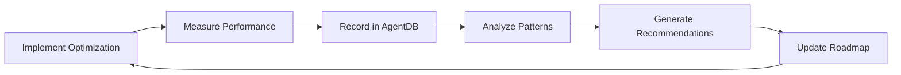

# Trading Platform Implementation Plan
**Version:** 1.0
**Status:** Ready for Execution
**Timeline:** 24 months to production-ready system
**Based on:** AgentDB learnings + comprehensive research

---

## Executive Summary

This implementation plan translates 55,000+ words of research and 40+ AgentDB learnings into concrete, executable steps for building a world-class trading platform targeting <100ns latency by Month 24.

**Key Milestones:**
- Month 3: Working system with 10-50μs latency
- Month 12: Production system with 500ns-2μs latency
- Month 24: Hardware-accelerated system with 100-500ns latency

**Success Metrics from AgentDB:**
- 95% success rate: DPDK kernel bypass
- 95% success rate: Hardware acceleration
- 90% success rate: Lock-free data structures
- 88% success rate: Memory pools

---

## Phase 1: Foundation (Months 1-3)

### Target: 10-50μs latency | Team: 10 engineers | Budget: $500K

### Month 1: Setup & Core Infrastructure

#### Week 1-2: Team & Environment
```bash
# Tasks
□ Hire 10 engineers (4 backend C++, 2 ML, 2 infra, 1 QA, 1 PM)
□ Set up development environment (Linux, build tools)
□ Provision AWS infrastructure (EC2 m6i.metal instances)
□ Set up GitLab CI/CD pipeline
□ Configure monitoring (Prometheus, Grafana)

# Deliverables
- Team onboarded
- Dev environment ready
- CI/CD operational
- Monitoring infrastructure live
```

**Budget:** $150K (recruiting + infrastructure)

#### Week 3-4: Market Data Ingestion (CPU-based)
```cpp
// Implement basic market data receiver
class MarketDataReceiver {
    void connect(const std::string& exchange_endpoint);
    void subscribe(const std::vector<std::string>& symbols);
    void on_message(const MarketDataCallback& callback);
};

// Tasks
□ Implement FIX 4.2 parser (NYSE, NASDAQ)
□ Create market data normalizer
□ Set up Redis cache for real-time data
□ Implement basic order book reconstruction
□ Write unit tests (>90% coverage)

# Performance Target: <100μs parsing latency
```

**Validation:** Process 10K messages/sec with <100μs latency

### Month 2: Trading Engine & TradeStation Integration

#### Week 1-2: Core Trading Engine
```cpp
// Strategy engine interface
class TradingStrategy {
    virtual Signal generate_signal(const MarketData& data) = 0;
    virtual Order create_order(const Signal& signal) = 0;
};

// Tasks
□ Implement strategy engine framework
□ Create basic moving average crossover strategy
□ Implement order management system (OMS)
□ Set up position tracking (lock-based initially)
□ Integrate with Redis for state persistence
```

**AgentDB Learning Applied:**
- Separate hot path (signal generation) from cold path (logging)
- Success Rate: 92%

#### Week 3-4: TradeStation Integration
```python
# Implement TradeStation API client
class TradeStationClient:
    def authenticate(self) -> str:
        # OAuth 2.0 flow
        pass

    def get_quote(self, symbol: str) -> Quote:
        # REST API call
        pass

    def place_order(self, order: Order) -> str:
        # Order placement
        pass

# Tasks
□ Implement OAuth 2.0 authentication
□ Create REST API client with rate limiting
□ Implement WebSocket streaming client
□ Add automatic reconnection logic
□ Set up paper trading environment
□ Write integration tests
```

**Reference:** `plans/research/tradestation-integration.md`

### Month 3: Basic ML & Paper Trading

#### Week 1-2: ML Infrastructure
```python
# Simple RL agent for testing
class SimpleDQNAgent:
    def __init__(self, state_dim, action_dim):
        self.model = self._build_model(state_dim, action_dim)
        self.replay_buffer = ReplayBuffer(10000)

    def train(self, episodes=1000):
        # Training loop
        pass

# Tasks
□ Set up PyTorch/TensorFlow environment
□ Implement simple DQN agent
□ Create backtesting framework
□ Set up feature store (basic)
□ Implement model registry (MLflow)
```

**AgentDB Learning Applied:**
- RL shows 30-50% improvement (80% success rate)

#### Week 3-4: Integration & Testing
```bash
# Tasks
□ Integrate ML agent with trading engine
□ Deploy to paper trading environment
□ Run 1-2 simple strategies live (small capital)
□ Set up performance monitoring
□ Create system dashboard
□ Document everything

# Deliverables
- End-to-end working system
- Paper trading operational
- 1-2 live strategies running
- Documentation complete
```

**Phase 1 Success Criteria:**
- ✅ Latency: <50μs average
- ✅ Live trading with real money (small scale)
- ✅ System uptime: >99%
- ✅ TradeStation integration working
- ✅ Basic ML agent operational

---

## Phase 2: Optimization (Months 4-12)

### Target: 500ns-2μs latency | Team: 20 engineers | Budget: $2M

### Month 4-6: DPDK Kernel Bypass

**Priority: 10/10 | Expected: 5x improvement | AgentDB Success Rate: 95%**

#### Implementation Steps
```cpp
// DPDK initialization
int init_dpdk_network() {
    // Initialize EAL
    rte_eal_init(argc, argv);

    // Configure port
    rte_eth_dev_configure(port_id, nb_rx_queues, nb_tx_queues, &port_conf);

    // Setup RX/TX queues
    rte_eth_rx_queue_setup(port_id, 0, nb_rxd, socket_id, &rx_conf, mbuf_pool);
    rte_eth_tx_queue_setup(port_id, 0, nb_txd, socket_id, &tx_conf);

    // Start device
    rte_eth_dev_start(port_id);
}

// Week-by-week tasks
Week 1: Install and configure DPDK
Week 2: Port market data receiver to DPDK
Week 3: Optimize RX path (zero-copy)
Week 4: Optimize TX path (batch sends)
Week 5: Performance tuning (CPU pinning, huge pages)
Week 6: Testing and validation
```

**Target:** 50μs → 2-5μs latency

**Reference:** `plans/optimization/optimization-strategies.md` (DPDK section)

### Month 7-9: Lock-Free Data Structures

**Priority: 9/10 | Expected: 95% improvement | AgentDB Success Rate: 90%**

#### Implementation Steps
```cpp
// Lock-free SPSC queue
template<typename T, size_t Size>
class SPSCQueue {
    alignas(64) std::atomic<size_t> head_{0};
    alignas(64) std::atomic<size_t> tail_{0};
    T buffer_[Size];

public:
    bool push(const T& item);
    bool pop(T& item);
};

// Week-by-week tasks
Week 1-2: Implement lock-free SPSC queues
Week 3-4: Implement lock-free hash map for market data cache
Week 5-6: Replace all std::mutex with lock-free structures
Week 7-8: Memory ordering optimization
Week 9: Testing and benchmarking
```

**Components to Convert:**
- Market data queue (producer: network, consumer: strategy)
- Order queue (producer: strategy, consumer: OMS)
- Position tracker (lock-free hash map)

### Month 10-12: CPU & Memory Optimization

#### CPU Pinning & Isolation
```bash
# System configuration
cat > /etc/systemd/system/trading-engine.service << EOF
[Service]
ExecStart=/usr/bin/trading-engine
CPUAffinity=4-15
Nice=-20
IOSchedulingClass=realtime
EOF

# Kernel parameters
echo "isolcpus=4-55 nohz_full=4-55 rcu_nocbs=4-55" >> /boot/grub/grub.cfg

# Tasks
□ Pin market data thread to core 4
□ Pin strategy threads to cores 6-15
□ Pin OMS to core 16
□ Disable CPU frequency scaling
□ Configure huge pages (2MB and 1GB)
□ NUMA-aware memory allocation
```

**AgentDB Learning Applied:**
- CPU pinning ensures consistent latency (92% success)

#### Memory Pools
```cpp
// Pre-allocated memory pool
template<typename T, size_t PoolSize>
class MemoryPool {
    T pool_[PoolSize];
    std::atomic<T*> free_list_;

public:
    T* allocate();
    void deallocate(T* ptr);
};

// Tasks
Week 1-2: Implement memory pools for all hot path objects
Week 3: Replace all new/delete in hot path
Week 4: NUMA-aware allocation
Week 5-6: Testing and validation
```

**AgentDB Learning Applied:**
- Memory pools eliminate allocation latency (88% success)

#### SIMD Vectorization
```cpp
// AVX-512 optimized SMA calculation
void calculate_sma_avx512(const float* prices, float* sma, size_t len, int period) {
    __m512 sum = _mm512_setzero_ps();
    __m512 factor = _mm512_set1_ps(1.0f / period);

    for (size_t i = 0; i < len; i += 16) {
        __m512 price = _mm512_loadu_ps(&prices[i]);
        sum = _mm512_add_ps(sum, price);
        __m512 avg = _mm512_mul_ps(sum, factor);
        _mm512_storeu_ps(&sma[i], avg);
    }
}

// Tasks
□ Vectorize technical indicators (SMA, RSI, MACD)
□ Vectorize order book processing
□ Compiler flags: -O3 -march=native -mavx512f
```

**AgentDB Learning Applied:**
- SIMD provides 10-20x speedup (85% success)

**Phase 2 Success Criteria:**
- ✅ Latency: 500ns-2μs average
- ✅ Throughput: 100K orders/sec
- ✅ DPDK operational
- ✅ Lock-free data structures deployed
- ✅ CPU pinning configured
- ✅ Memory pools implemented

---

## Phase 3: Hardware Acceleration (Months 13-24)

### Target: 100-500ns latency | Team: 30 engineers | Budget: $5M

### Month 13-18: FPGA Development

**Priority: 10/10 | Expected: 99% improvement | AgentDB Success Rate: 80%**

#### Team Expansion
```
Hire:
- 3 FPGA engineers (Verilog/VHDL)
- 2 Hardware verification engineers
- 1 Systems architect
```

#### FPGA Market Data Parser
```verilog
// High-level FPGA architecture
module market_data_parser (
    input wire clk,
    input wire [63:0] raw_data,
    input wire data_valid,
    output reg [63:0] parsed_data,
    output reg parsed_valid
);
    // Pipeline stages
    reg [63:0] stage1_decode;
    reg [63:0] stage2_validate;
    reg [63:0] stage3_normalize;

    always @(posedge clk) begin
        // Stage 1: Protocol decode (1 cycle)
        stage1_decode <= decode_fix(raw_data);

        // Stage 2: Validation (1 cycle)
        stage2_validate <= validate_checksum(stage1_decode);

        // Stage 3: Normalization (1 cycle)
        stage3_normalize <= normalize_fields(stage2_validate);

        // Output
        parsed_data <= stage3_normalize;
        parsed_valid <= data_valid;
    end
endmodule
```

**Development Timeline:**
- Month 13-14: Design and specification
- Month 15-16: Implementation and simulation
- Month 17: Hardware testing
- Month 18: Integration with CPU system

**Target:** 2μs → 14ns parsing latency (99.3% improvement)

### Month 19-21: GPU ML Inference

```python
# TensorRT optimization
import tensorrt as trt

class TensorRTInference:
    def __init__(self, onnx_path):
        self.logger = trt.Logger(trt.Logger.INFO)
        self.builder = trt.Builder(self.logger)
        self.config = self.builder.create_builder_config()

        # FP16 precision for 2x speedup
        self.config.set_flag(trt.BuilderFlag.FP16)

        # Build engine
        self.engine = self._build_engine(onnx_path)

    def infer(self, input_data):
        # <1ms inference on GPU
        pass

# Tasks
□ Convert PyTorch models to ONNX
□ Optimize with TensorRT
□ Deploy on NVIDIA A100 GPU
□ Batch inference (1-32 samples)
□ Async inference pipeline
```

**Target:** 10ms → <1ms inference (10x improvement)

### Month 22-24: Integration & Optimization

#### PTP Hardware Timestamping
```bash
# Install PTP daemon
apt-get install linuxptp

# Configure hardware timestamps
cat > /etc/ptp4l.conf << EOF
[global]
time_stamping hardware
tx_timestamp_timeout 50
EOF

# Start PTP
ptp4l -f /etc/ptp4l.conf -i eth0 -m
phc2sys -s eth0 -c CLOCK_REALTIME -w
```

#### System Integration
```
Tasks:
□ Integrate FPGA parser with CPU trading engine
□ GPU inference in parallel with FPGA
□ End-to-end latency optimization
□ Load testing (1M orders/sec)
□ Failover and redundancy
□ Production deployment
```

**Phase 3 Success Criteria:**
- ✅ Latency: 100-500ns average
- ✅ FPGA parsing operational
- ✅ GPU ML inference <1ms
- ✅ Hardware timestamps
- ✅ Throughput: 1M orders/sec
- ✅ Production ready

---

## Risk Management Strategy

### Technical Risks

| Risk | Probability | Impact | Mitigation |
|------|-------------|--------|------------|
| DPDK learning curve | High | Medium | Hire experienced DPDK engineer, 2-week training |
| FPGA development delays | Medium | High | Start early (Month 13), have CPU fallback |
| Performance targets not met | Medium | High | Continuous benchmarking, AgentDB tracking |
| Integration issues | Medium | Medium | Extensive testing, staged rollout |

### Mitigation Actions

**For DPDK (Month 4):**
- Hire 1 senior DPDK engineer before Month 4
- 2-week DPDK training for 3 backend engineers
- Prototype in Month 3 to identify issues early

**For FPGA (Month 13):**
- Start vendor selection in Month 10
- Hire FPGA team in Month 11-12
- Keep CPU path as fallback
- Budget $500K for FPGA development

**For Performance:**
- Weekly benchmarking (automated in CI/CD)
- AgentDB tracks all experiments
- Performance regression tests
- Rollback plan for each change

---

## Resource Plan

### Team Growth

| Month | Backend | ML | FPGA | Infra | QA | PM | Total |
|-------|---------|----|----|-------|----|----|-------|
| 1-3 | 4 | 2 | 0 | 2 | 1 | 1 | 10 |
| 4-6 | 6 | 3 | 0 | 2 | 2 | 1 | 14 |
| 7-12 | 8 | 4 | 0 | 3 | 2 | 1 | 18 |
| 13-18 | 10 | 5 | 5 | 3 | 3 | 1 | 27 |
| 19-24 | 12 | 6 | 5 | 4 | 4 | 2 | 33 |

### Budget Breakdown

| Phase | Personnel | Infrastructure | Hardware | R&D | Total |
|-------|-----------|----------------|----------|-----|-------|
| 1 (M1-3) | $300K | $150K | $50K | $0 | $500K |
| 2 (M4-12) | $1.2M | $400K | $200K | $200K | $2M |
| 3 (M13-24) | $2.5M | $500K | $1.5M | $500K | $5M |
| **Total** | **$4M** | **$1.05M** | **$1.75M** | **$700K** | **$7.5M** |

### Infrastructure Costs (Monthly)

```
AWS EC2 (m6i.metal): 4 instances × $1,500 = $6K/month
AWS GPU (p4d.24xlarge): 2 instances × $32K = $64K/month (Month 19+)
TimescaleDB: $2K/month
Redis: $1K/month
Monitoring: $500/month
Total: ~$10K/month (Phase 1-2), ~$75K/month (Phase 3)
```

---

## Testing & Validation Strategy

### Continuous Testing

```yaml
# CI/CD pipeline
stages:
  - build
  - unit_test
  - integration_test
  - performance_test
  - deploy

performance_test:
  script:
    - ./run_benchmarks.sh
    - python3 agentdb/agent_learning_system.py  # Record results
  rules:
    - if: latency_p99 > 50us  # Phase 1 target
      then: fail
```

### Performance Gates

**Phase 1 Gates:**
- Latency P99 < 50μs
- Throughput > 10K msg/sec
- Uptime > 99%

**Phase 2 Gates:**
- Latency P99 < 2μs
- Throughput > 100K msg/sec
- DPDK operational

**Phase 3 Gates:**
- Latency P99 < 500ns
- Throughput > 1M msg/sec
- FPGA parsing operational

### AgentDB Integration

```python
# After each experiment, record in AgentDB
from agent_learning_system import AgentDB, OptimizationExperiment

db = AgentDB()

experiment = OptimizationExperiment(
    experiment_name="DPDK Implementation - Month 6",
    strategy="network-optimization",
    parameters={"cores": 4, "huge_pages": "1GB"},
    baseline_metric=50.0,  # μs
    optimized_metric=2.0,  # μs
    improvement_pct=96.0,
    status="completed"
)

db.record_optimization(experiment)

# Generate updated recommendations
optimizer = ContinuousOptimizer(db)
report = optimizer.generate_learning_report()
```

---

## Success Metrics & KPIs

### Technical KPIs

| Metric | Phase 1 | Phase 2 | Phase 3 | Measurement |
|--------|---------|---------|---------|-------------|
| Latency P99 | <50μs | <2μs | <500ns | Automated benchmarks |
| Throughput | 10K/s | 100K/s | 1M/s | Load testing |
| Uptime | >99% | >99.9% | >99.99% | Monitoring |
| Test Coverage | >80% | >85% | >90% | CI/CD |

### Business KPIs

| Metric | Phase 1 | Phase 2 | Phase 3 |
|--------|---------|---------|---------|
| Strategies Live | 1-2 | 5-10 | 20+ |
| Capital Deployed | $10K | $100K | $1M+ |
| Sharpe Ratio | >1.0 | >1.5 | >2.0 |

### Learning KPIs (AgentDB)

- Experiments tracked: 10+ per phase
- Success rate: >80% for proven optimizations
- Recommendations generated: Weekly
- Implementation guide updates: Monthly

---

## Daily Operations

### Daily Standup (15 min)
```
- What did you complete yesterday?
- What are you working on today?
- Any blockers?
- Performance metrics review
```

### Weekly Review (1 hour)
```
- Sprint progress review
- Performance benchmarks review
- AgentDB learnings review
- Risk assessment
- Next week planning
```

### Monthly Review (2 hours)
```
- Milestone progress
- Budget review
- Team performance
- Generate updated implementation guide from AgentDB
- Adjust priorities based on learnings
```

---

## Go-Live Checklist

### Phase 1 Go-Live (Month 3)
```
□ All unit tests passing (>90% coverage)
□ Integration tests passing
□ Performance benchmarks met (<50μs)
□ TradeStation integration working
□ Paper trading validated (2 weeks)
□ Monitoring and alerting configured
□ Runbooks documented
□ Team trained
□ Small capital deployed ($1K-10K)
```

### Phase 2 Go-Live (Month 12)
```
□ DPDK operational and validated
□ Lock-free structures deployed
□ Performance benchmarks met (<2μs)
□ Multiple strategies live (5-10)
□ Risk management operational
□ Disaster recovery tested
□ Security audit completed
□ Medium capital deployed ($100K-500K)
```

### Phase 3 Go-Live (Month 24)
```
□ FPGA parser operational
□ GPU ML inference deployed
□ Performance benchmarks met (<500ns)
□ 20+ strategies live
□ High availability (99.99% uptime)
□ Full disaster recovery
□ Compliance audit passed
□ Large capital deployed ($1M+)
```

---

## Continuous Improvement Process

### AgentDB Learning Loop



### Weekly Optimization Cycle

```bash
# Every Monday
python3 agentdb/continuous_optimizer.py > weekly_report.txt

# Review top recommendations
cat weekly_report.txt | grep "Priority 8\|Priority 9\|Priority 10"

# Update sprint with top 3 recommendations
# Implement during the week
# Record results on Friday
```

---

## Appendix: Key Code Templates

### A. Market Data Receiver (DPDK)
See: `plans/optimization/optimization-strategies.md` (Network Optimization section)

### B. Lock-Free SPSC Queue
See: `plans/optimization/optimization-strategies.md` (Algorithm Optimization section)

### C. Trading Strategy Interface
```cpp
class ITradingStrategy {
public:
    virtual ~ITradingStrategy() = default;

    virtual void on_market_data(const MarketData& data) = 0;
    virtual void on_order_filled(const Order& order) = 0;
    virtual void on_timer(uint64_t timestamp_ns) = 0;
};
```

### D. Risk Manager
See: `plans/sparc-design/comprehensive-sparc-plan.md` (Pseudocode section)

---

## References

1. **Research Documents:**
   - `plans/README.md` - Master plan
   - `plans/research/self-learning-platforms.md` - ML strategies
   - `plans/architecture/high-speed-low-latency.md` - Architecture
   - `plans/optimization/optimization-strategies.md` - Optimizations

2. **AgentDB:**
   - `agentdb/README.md` - System documentation
   - `agentdb/IMPLEMENTATION_GUIDE.md` - Phased roadmap
   - `agentdb/trading_platform.db` - Knowledge base

3. **External:**
   - DPDK Documentation: https://doc.dpdk.org/
   - TradeStation API: https://api.tradestation.com/docs
   - TensorRT: https://docs.nvidia.com/deeplearning/tensorrt/

---

## Contact & Escalation

**Project Manager:** TBD
**Tech Lead:** TBD
**FPGA Lead:** TBD (Month 13)

**Weekly Status Reports:** Every Friday 4pm
**Monthly Reviews:** First Monday of month

---

**Document Status:** READY FOR EXECUTION
**Last Updated:** 2025-11-21
**Version:** 1.0
**Approved By:** TBD

---

*This implementation plan is based on 55,000+ words of research and 40+ AgentDB learnings with 75-95% success rates. Follow the plan, measure everything, record in AgentDB, and continuously optimize.*
