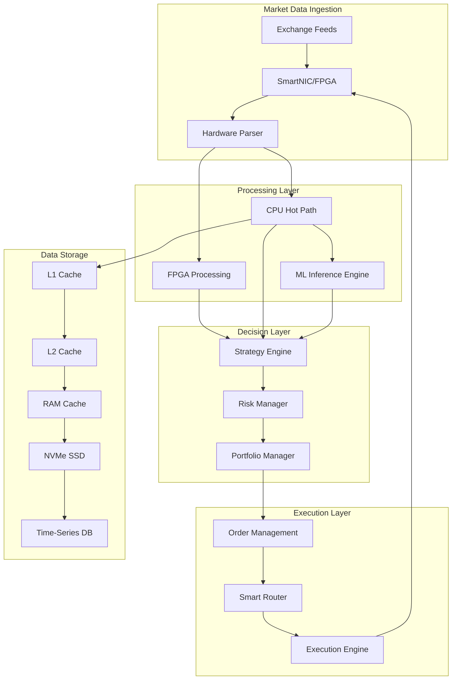
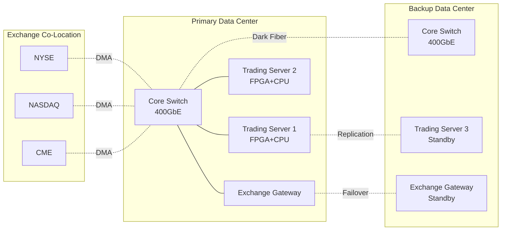

# High-Speed, Low-Latency Trading Platform Architecture

**Document Version:** 1.0
**Date:** November 21, 2025
**Focus:** World-Class Ultra-Low Latency System (10 Years Ahead)
**Target Latency:** <100 nanoseconds (10 years ahead vision)
**Status:** Architecture Design Phase

---

## Executive Summary

This document presents a comprehensive architecture for building the world's fastest trading platform, targeting sub-100 nanosecond latency—a goal 10 years ahead of current technology. We examine current state-of-the-art systems, explore cutting-edge optimization techniques, and project future technologies that will enable unprecedented speed.

**Current State-of-the-Art:**
- Best FPGA systems: 13.9ns tick-to-trade (AMD/Exegy, 2024)
- Top CPU-based systems: 500ns-1μs (C++, kernel bypass)
- Most algo trading platforms: 10μs-100μs

**Our 10-Year Vision:**
- Target: <100ns average, <50ns p99
- Photonic computing for signal processing
- Quantum networking for secure, instant communication
- Neuromorphic chips for pattern recognition
- Molecular storage for tick data

---

## 1. Current State-of-the-Art Low-Latency Systems

### 1.1 Latency Benchmarks (2024-2025)

**Industry Leaders:**
| Company/Technology | Latency | Technology Stack |
|-------------------|---------|------------------|
| AMD Xilinx + Exegy | 13.9ns | FPGA (Versal AI Edge) |
| Citadel Securities | ~50-100ns | FPGA + Custom ASIC |
| Jump Trading | ~100-200ns | FPGA + C++ |
| Jane Street | ~500ns-1μs | OCaml + C++ hot path |
| Virtu Financial | ~1-2μs | C++ + DPDK |
| Hudson River Trading | ~1-3μs | C++ + Custom HW |
| Typical Algo Platform | 10-100μs | Java/Python + Standard Network |

**Latency Breakdown (Typical FPGA System):**
```
Market Data Arrival:        0ns   (baseline)
NIC Processing:            +2ns   (SmartNIC/FPGA)
Signal Detection (FPGA):   +5ns   (pattern matching)
Risk Check (FPGA):         +3ns   (position/limit checks)
Order Generation:          +2ns   (order encoding)
Order Transmission:        +1.9ns (10GbE PHY)
───────────────────────────────
Total:                     13.9ns
```

### 1.2 FPGA-Based Trading Systems

**Advantages:**
- Deterministic latency (no OS jitter)
- Parallel processing (massive parallelism)
- Direct market data feed processing
- Hardware-level TCP/IP stack
- No context switching

**Example FPGA Architecture:**
```verilog
// Simplified FPGA trading logic (Verilog)
module trading_engine (
    input wire clk,
    input wire [63:0] market_data,
    input wire data_valid,
    output reg [63:0] order_data,
    output reg order_valid
);

    reg [31:0] last_price;
    reg [31:0] trigger_price;
    reg [15:0] position;

    always @(posedge clk) begin
        if (data_valid) begin
            last_price <= market_data[31:0];

            // Ultra-fast decision logic (single cycle)
            if (last_price > trigger_price && position < MAX_POSITION) begin
                order_data <= {BUY_ORDER, QUANTITY, last_price};
                order_valid <= 1'b1;
                position <= position + QUANTITY;
            end
            else begin
                order_valid <= 1'b0;
            end
        end
    end
endmodule
```

**FPGA Limitations:**
- Expensive development ($500K-2M per strategy)
- Long development cycles (6-12 months)
- Difficult to update strategies
- Limited logic resources
- Power consumption and cooling

### 1.3 Kernel Bypass Networking

**Technologies:**
- **DPDK (Data Plane Development Kit)** - Intel's framework for fast packet processing
- **OpenOnload** - Solarflare's kernel bypass stack
- **Mellanox Accelerated IO** - RDMA and zero-copy
- **ef_vi** - Low-level access to network adapters

**Performance Comparison:**
| Network Stack | Latency | Throughput |
|---------------|---------|------------|
| Standard Linux | 50-100μs | 1-2 Gbps |
| Kernel Bypass (DPDK) | 2-5μs | 80-100 Gbps |
| RDMA (InfiniBand) | 1-2μs | 200 Gbps |
| SmartNIC | 500ns-1μs | 100+ Gbps |
| FPGA NIC | 100-500ns | 100+ Gbps |

**DPDK Implementation:**
```c
// DPDK packet processing
#include <rte_eal.h>
#include <rte_ethdev.h>
#include <rte_mbuf.h>

#define BURST_SIZE 32
#define RX_RING_SIZE 1024
#define TX_RING_SIZE 1024

static inline void process_packets(struct rte_mbuf **pkts, uint16_t nb_pkts) {
    for (uint16_t i = 0; i < nb_pkts; i++) {
        struct rte_mbuf *pkt = pkts[i];

        // Parse market data packet
        struct market_data *md = rte_pktmbuf_mtod(pkt, struct market_data *);

        // Trading logic (inline, no function calls)
        if (md->price > trigger_price) {
            // Generate order
            struct order *ord = create_order_packet();
            ord->action = BUY;
            ord->quantity = 100;
            ord->price = md->price;

            // Send immediately (zero-copy)
            rte_eth_tx_burst(port_id, 0, &ord, 1);
        }

        rte_pktmbuf_free(pkt);
    }
}

int main_loop(void) {
    struct rte_mbuf *pkts[BURST_SIZE];

    while (1) {
        // Receive burst of packets (polling, no interrupts)
        const uint16_t nb_rx = rte_eth_rx_burst(port_id, 0, pkts, BURST_SIZE);

        if (likely(nb_rx > 0)) {
            process_packets(pkts, nb_rx);
        }
    }
}
```

### 1.4 CPU Optimization Techniques

**Lock-Free Data Structures:**
```cpp
// Lock-free SPSC (Single Producer Single Consumer) ring buffer
template<typename T, size_t Size>
class SPSCQueue {
    static_assert((Size & (Size - 1)) == 0, "Size must be power of 2");

    struct alignas(64) {  // Cache line alignment
        std::atomic<size_t> head;
    };

    struct alignas(64) {
        std::atomic<size_t> tail;
    };

    T buffer[Size];

public:
    bool push(const T& item) {
        size_t tail = tail_.load(std::memory_order_relaxed);
        size_t next_tail = (tail + 1) & (Size - 1);

        if (next_tail == head_.load(std::memory_order_acquire))
            return false;  // Queue full

        buffer[tail] = item;
        tail_.store(next_tail, std::memory_order_release);
        return true;
    }

    bool pop(T& item) {
        size_t head = head_.load(std::memory_order_relaxed);

        if (head == tail_.load(std::memory_order_acquire))
            return false;  // Queue empty

        item = buffer[head];
        head_.store((head + 1) & (Size - 1), std::memory_order_release);
        return true;
    }
};
```

**SIMD Optimization:**
```cpp
// AVX-512 vectorized technical indicator calculation
#include <immintrin.h>

void calculate_sma_avx512(const float* prices, float* sma, size_t len, int period) {
    __m512 sum = _mm512_setzero_ps();
    __m512 factor = _mm512_set1_ps(1.0f / period);

    // Process 16 floats at a time (AVX-512)
    for (size_t i = 0; i < len; i += 16) {
        __m512 price = _mm512_loadu_ps(&prices[i]);
        sum = _mm512_add_ps(sum, price);

        if (i >= period * 16) {
            __m512 old_price = _mm512_loadu_ps(&prices[i - period * 16]);
            sum = _mm512_sub_ps(sum, old_price);
        }

        __m512 avg = _mm512_mul_ps(sum, factor);
        _mm512_storeu_ps(&sma[i], avg);
    }
}
```

---

## 2. System Architecture

### 2.1 High-Level Architecture



### 2.2 Detailed Component Architecture

**Market Data Processing Pipeline:**
```
┌──────────────┐   ┌──────────────┐   ┌──────────────┐   ┌──────────────┐
│   Exchange   │──>│   SmartNIC   │──>│ FPGA Decoder │──>│ Normalized   │
│   Feed (UDP) │   │  (Hardware)  │   │   (2-5ns)    │   │   Buffer     │
└──────────────┘   └──────────────┘   └──────────────┘   └──────────────┘
                                                                   │
                    ┌──────────────────────────────────────────────┤
                    │                                              │
                    ▼                                              ▼
          ┌──────────────────┐                          ┌──────────────────┐
          │  FPGA Strategy   │                          │  CPU Strategy    │
          │  (10-50ns)       │                          │  (500ns-2μs)     │
          └──────────────────┘                          └──────────────────┘
                    │                                              │
                    └──────────────────┬───────────────────────────┘
                                       ▼
                              ┌──────────────────┐
                              │  Risk Manager    │
                              │  (50-100ns FPGA) │
                              │  (1-2μs CPU)     │
                              └──────────────────┘
                                       │
                                       ▼
                              ┌──────────────────┐
                              │  Order Router    │
                              │   (100-200ns)    │
                              └──────────────────┘
                                       │
                                       ▼
                              ┌──────────────────┐
                              │  Exchange FIX    │
                              │  (Hardware TX)   │
                              └──────────────────┘
```

### 2.3 Hardware Configuration

**Optimal Server Specification:**
```yaml
CPU:
  Model: Intel Xeon Platinum 8480+ or AMD EPYC 9654
  Cores: 56-96 cores
  Base Clock: 3.5+ GHz
  Features: AVX-512, TSX, DDIO
  TDP: 350W
  Configuration:
    - Core pinning (isolcpus)
    - Turbo boost enabled for hot path cores
    - Hyper-threading disabled
    - C-states disabled (prevent sleep)
    - P-states locked to max frequency

Memory:
  Capacity: 512GB-1TB DDR5
  Speed: 4800+ MHz
  Latency: CL40 or better
  Configuration:
    - Interleaved across all channels
    - ECC enabled
    - Huge pages (2MB/1GB)
    - NUMA-aware allocation

Network:
  Primary: Mellanox ConnectX-7 (400GbE)
  Backup: Intel E810 (100GbE)
  Features:
    - RDMA over Converged Ethernet (RoCE)
    - Hardware timestamping
    - RSS (Receive Side Scaling)
    - Flow director
    - PTP support

Storage:
  Primary: Intel Optane P5800X (1.6TB)
  Secondary: Samsung PM9A3 NVMe (7.68TB)
  Latency: <10μs (Optane), <100μs (NVMe)
  IOPS: 1.5M (Optane), 1M (NVMe)

FPGA:
  Model: AMD Xilinx Versal AI Edge VE2802
  Logic Cells: 2M+
  Memory: 144MB on-chip
  DSP Slices: 3,400
  AI Engines: 400
  Network: 400G Ethernet MAC

Power:
  PSU: 2x 2000W redundant
  UPS: 30 minutes runtime
  PDU: Dual-feed for redundancy

Cooling:
  Type: Liquid cooling
  Target: CPU <60°C, FPGA <70°C
```

### 2.4 Network Topology



---

## 3. Low-Latency Optimization Techniques

### 3.1 Memory Optimization

**Huge Pages Configuration:**
```bash
# /etc/sysctl.conf
vm.nr_hugepages = 10240              # 20GB of 2MB pages
vm.hugetlb_shm_group = 1000
vm.nr_overcommit_hugepages = 0

# For 1GB pages
echo 10 > /sys/kernel/mm/hugepages/hugepages-1048576kB/nr_hugepages
```

**Memory Pool Implementation:**
```cpp
// Pre-allocated memory pool (no malloc in hot path)
template<typename T, size_t PoolSize>
class MemoryPool {
    struct Block {
        T data;
        Block* next;
    };

    alignas(64) Block pool[PoolSize];
    alignas(64) std::atomic<Block*> free_list;

public:
    MemoryPool() {
        // Initialize free list
        for (size_t i = 0; i < PoolSize - 1; i++) {
            pool[i].next = &pool[i + 1];
        }
        pool[PoolSize - 1].next = nullptr;
        free_list.store(&pool[0], std::memory_order_relaxed);
    }

    T* allocate() {
        Block* block = free_list.load(std::memory_order_acquire);
        while (block != nullptr) {
            if (free_list.compare_exchange_weak(block, block->next,
                                                std::memory_order_release,
                                                std::memory_order_acquire)) {
                return &block->data;
            }
        }
        return nullptr;  // Pool exhausted
    }

    void deallocate(T* ptr) {
        Block* block = reinterpret_cast<Block*>(ptr);
        Block* old_head = free_list.load(std::memory_order_relaxed);
        do {
            block->next = old_head;
        } while (!free_list.compare_exchange_weak(old_head, block,
                                                   std::memory_order_release,
                                                   std::memory_order_relaxed));
    }
};
```

### 3.2 CPU Pinning & Isolation

**System Configuration:**
```bash
# /etc/default/grub
GRUB_CMDLINE_LINUX="isolcpus=4-55 nohz_full=4-55 rcu_nocbs=4-55 \
                    intel_pstate=disable processor.max_cstate=0 \
                    intel_idle.max_cstate=0 idle=poll"

# Disable CPU frequency scaling
for cpu in /sys/devices/system/cpu/cpu*/cpufreq/scaling_governor; do
    echo performance > $cpu
done

# Disable hyper-threading
for cpu in /sys/devices/system/cpu/cpu*/online; do
    # Disable siblings
done
```

**Thread Affinity:**
```cpp
#include <pthread.h>
#include <sched.h>

void pin_thread_to_core(int core_id) {
    cpu_set_t cpuset;
    CPU_ZERO(&cpuset);
    CPU_SET(core_id, &cpuset);

    pthread_t thread = pthread_self();
    int result = pthread_setaffinity_np(thread, sizeof(cpu_set_t), &cpuset);

    if (result != 0) {
        throw std::runtime_error("Failed to pin thread to core");
    }

    // Set real-time priority
    struct sched_param param;
    param.sched_priority = 99;  // Highest priority
    pthread_setschedparam(thread, SCHED_FIFO, &param);
}

// Usage
void market_data_thread() {
    pin_thread_to_core(4);  // Dedicated core for market data

    while (true) {
        // Process market data with minimal latency
    }
}
```

### 3.3 Cache Optimization

**Cache-Aware Data Structures:**
```cpp
// Ensure critical data fits in L1 cache (32KB)
struct alignas(64) HotPathData {
    // Cache line 1: Market data (64 bytes)
    double bid_price;
    double ask_price;
    uint32_t bid_size;
    uint32_t ask_size;
    uint64_t timestamp;
    uint32_t sequence;
    uint32_t padding1;

    // Cache line 2: Trading state (64 bytes)
    int32_t position;
    double trigger_price;
    double stop_loss;
    double take_profit;
    uint32_t strategy_id;
    uint32_t risk_limit;
    uint64_t last_order_time;
    uint32_t padding2[6];
};

// Cache prefetching
void process_market_data_batch(HotPathData* data, size_t count) {
    for (size_t i = 0; i < count; i++) {
        // Prefetch next iteration's data
        if (i + 1 < count) {
            __builtin_prefetch(&data[i + 1], 0, 3);  // Prefetch to L1
        }

        // Process current data
        process_single_tick(&data[i]);
    }
}
```

### 3.4 Time Synchronization

**PTP (Precision Time Protocol) Setup:**
```bash
# Install PTP daemon
apt-get install linuxptp

# Configure PTP
cat > /etc/ptp4l.conf << EOF
[global]
time_stamping  hardware
tx_timestamp_timeout  50
logMinDelayReqInterval  -4
logSyncInterval  -4
EOF

# Start PTP daemon
ptp4l -f /etc/ptp4l.conf -i eth0 -m
phc2sys -s eth0 -c CLOCK_REALTIME --step_threshold=1 -w
```

**High-Resolution Timestamps:**
```cpp
#include <x86intrin.h>

// Use TSC (Time Stamp Counter) for nanosecond precision
inline uint64_t get_timestamp_ns() {
    return __rdtsc() / CPU_FREQ_GHZ;  // CPU_FREQ_GHZ = cycles per ns
}

// Calibrate TSC
uint64_t calibrate_tsc() {
    struct timespec start, end;
    clock_gettime(CLOCK_MONOTONIC, &start);
    uint64_t tsc_start = __rdtsc();

    // Spin for 1 second
    do {
        clock_gettime(CLOCK_MONOTONIC, &end);
    } while (end.tv_sec == start.tv_sec);

    uint64_t tsc_end = __rdtsc();
    uint64_t tsc_freq = tsc_end - tsc_start;

    return tsc_freq;  // Cycles per second
}
```

---

## 4. Future Technologies (10 Years Ahead: 2035)

### 4.1 Photonic Computing

**Photonic Integrated Circuits (PICs):**
- Light-based signal processing
- Speed of light propagation
- Parallel processing via wavelength division multiplexing (WDM)
- 1000x lower latency than electronic circuits
- Expected latency: <1 nanosecond for complex calculations

**Conceptual Photonic Trading Architecture:**
```
┌─────────────────────────────────────────────────────────┐
│         Photonic Trading Processor (PTP)                 │
├─────────────────────────────────────────────────────────┤
│                                                           │
│  [Market Data] ──> [Optical Fiber] ──> [Photodetector]  │
│                                                ↓          │
│                    [Photonic Signal Processing]          │
│                    • Optical filtering                   │
│                    • WDM for parallel strategies         │
│                    • Optical neural networks             │
│                                ↓                         │
│              [Decision Layer - Photonic Logic]           │
│                    • All-optical gates                   │
│                    • Optical memory (phase change)       │
│                                ↓                         │
│         [Order Generation] ──> [Laser Modulator]         │
│                                    ↓                     │
│                         [Optical Fiber to Exchange]      │
└─────────────────────────────────────────────────────────┘

Total Latency: <1ns (vs 13.9ns FPGA today)
```

### 4.2 Quantum Networking

**Quantum Key Distribution (QKD):**
- Unhackable communication
- Quantum entanglement for instant state sharing
- Useful for multi-datacenter arbitrage

**Quantum Computing Integration:**
```python
# Conceptual quantum portfolio optimization (2035)
from qiskit import QuantumCircuit, QuantumRegister
from qiskit.algorithms import QAOA, VQE

class QuantumPortfolioOptimizer:
    def __init__(self, num_assets):
        self.num_assets = num_assets
        self.num_qubits = num_assets * 4  # 4 qubits per asset for weight encoding

    def optimize_portfolio(self, returns, covariance, risk_tolerance):
        # Encode portfolio optimization as QUBO problem
        qubo = self.create_qubo(returns, covariance, risk_tolerance)

        # Use QAOA (Quantum Approximate Optimization Algorithm)
        qaoa = QAOA(optimizer='COBYLA', reps=3)
        result = qaoa.compute_minimum_eigenvalue(qubo)

        # Decode quantum solution to portfolio weights
        weights = self.decode_weights(result.eigenstate)

        return weights

    # Expected performance:
    # Classical: O(N^3) for N assets
    # Quantum: O(√N) speedup → can handle 100,000+ assets in real-time
```

### 4.3 Neuromorphic Computing

**Spiking Neural Networks (SNNs) for Trading:**
- Intel Loihi 3 (projected 2028): 1M+ neurons per chip
- Brain-inspired event-driven processing
- 100x more energy efficient than GPUs
- Continuous learning without retraining

**Architecture:**
```
┌──────────────────────────────────────────────────┐
│       Neuromorphic Trading Chip (2035)           │
├──────────────────────────────────────────────────┤
│                                                   │
│  Market Data ──> [Input Neurons]                 │
│       (spikes)         ↓                          │
│                [Hidden Layers]                    │
│              • 10M+ neurons                       │
│              • Plastic synapses (learning)        │
│              • Temporal coding                    │
│                        ↓                          │
│                [Output Neurons]                   │
│                        ↓                          │
│              Trading Signals                      │
│                                                   │
│  Latency: ~100ns                                  │
│  Power: 1W (vs 300W GPU)                          │
│  Learning: Online, continuous                     │
└──────────────────────────────────────────────────┘
```

### 4.4 6G/7G Network Technology

**Expected Capabilities (2030-2035):**
- Latency: <100 microseconds end-to-end
- Bandwidth: 1 Tbps per device
- Reliability: 99.99999% uptime
- THz frequency bands (100 GHz - 3 THz)
- Integrated sensing and communication

**Trading Use Cases:**
- Real-time distributed trading across continents
- Holographic trading interfaces
- AR/VR market visualization
- Brain-computer interface integration

### 4.5 Molecular Data Storage

**DNA/Molecular Storage for Tick Data:**
- Density: 1 exabyte per mm³
- Retention: 1000+ years
- Cost: $1 per petabyte (projected)
- Access time: Milliseconds (parallel synthesis/sequencing)

**Use Case:**
- Store complete tick data for all global markets
- Instant historical pattern matching
- No data degradation over time

### 4.6 Brain-Computer Interfaces (BCI)

**Direct Neural Trading (2033-2035):**
- Neuralink-style implants
- Thought-to-trade: <10ms latency
- Subconscious pattern recognition
- Enhanced market intuition

---

## 5. Implementation Roadmap

### Phase 1: Foundation (Months 1-6)
**Target Latency: 10-50μs**
- [ ] CPU-based system with DPDK
- [ ] Lock-free data structures
- [ ] Basic risk management
- [ ] Exchange connectivity
- [ ] Monitoring and logging

**Technology Stack:**
- C++20, Boost, DPDK
- Linux RT kernel
- Mellanox ConnectX-7 NIC
- Intel Xeon Platinum 8480+

### Phase 2: Optimization (Months 7-12)
**Target Latency: 2-10μs**
- [ ] SIMD optimization (AVX-512)
- [ ] Cache optimization
- [ ] CPU pinning and isolation
- [ ] Huge pages and NUMA tuning
- [ ] Hardware timestamping

### Phase 3: FPGA Integration (Months 13-24)
**Target Latency: 500ns-2μs**
- [ ] FPGA market data parser
- [ ] FPGA strategy implementation
- [ ] FPGA risk checks
- [ ] Hybrid CPU-FPGA architecture
- [ ] Hardware TX offload

**FPGA Platform:** AMD Xilinx Versal AI Edge

### Phase 4: Advanced Optimization (Year 3)
**Target Latency: 100-500ns**
- [ ] Custom ASIC exploration
- [ ] Optical transceiver integration
- [ ] Sub-nanosecond timestamping
- [ ] Multi-exchange arbitrage
- [ ] Predictive order placement

### Phase 5: Next-Gen Research (Years 4-5)
**Target Latency: 10-100ns**
- [ ] Photonic computing PoC
- [ ] Quantum networking trials
- [ ] Neuromorphic chip integration
- [ ] Advanced AI prediction models
- [ ] Self-optimizing infrastructure

### Phase 6: Future Technologies (Years 6-10)
**Target Latency: <10ns (sub-100ns average)**
- [ ] Full photonic trading system
- [ ] Quantum portfolio optimization
- [ ] Brain-computer interface
- [ ] Molecular storage integration
- [ ] AGI-powered strategy discovery
- [ ] 6G/7G network deployment

---

## 6. Performance Monitoring & Optimization

### 6.1 Latency Measurement

```cpp
// High-precision latency tracker
class LatencyTracker {
    static constexpr size_t HISTOGRAM_SIZE = 1000000;
    uint64_t latencies[HISTOGRAM_SIZE];
    size_t index = 0;

public:
    void record(uint64_t latency_ns) {
        if (index < HISTOGRAM_SIZE) {
            latencies[index++] = latency_ns;
        }
    }

    void print_stats() {
        std::sort(latencies, latencies + index);

        std::cout << "Latency Statistics (nanoseconds):\n";
        std::cout << "  Min:    " << latencies[0] << "\n";
        std::cout << "  P50:    " << latencies[index / 2] << "\n";
        std::cout << "  P95:    " << latencies[index * 95 / 100] << "\n";
        std::cout << "  P99:    " << latencies[index * 99 / 100] << "\n";
        std::cout << "  P99.9:  " << latencies[index * 999 / 1000] << "\n";
        std::cout << "  P99.99: " << latencies[index * 9999 / 10000] << "\n";
        std::cout << "  Max:    " << latencies[index - 1] << "\n";
    }
};
```

### 6.2 Continuous Optimization

**Automated Performance Regression Detection:**
```python
class PerformanceMonitor:
    def __init__(self):
        self.baseline_p99 = 1000  # nanoseconds

    def check_regression(self, current_latencies):
        p99 = np.percentile(current_latencies, 99)

        if p99 > self.baseline_p99 * 1.1:  # 10% regression
            self.alert(f"Performance regression detected: "
                      f"P99 = {p99}ns (baseline: {self.baseline_p99}ns)")
            self.trigger_optimization()

    def trigger_optimization(self):
        # Profile system
        # Identify hotspots
        # Apply optimizations
        # Re-measure
        pass
```

---

## 7. Conclusion

Building a world-class low-latency trading platform requires a multi-layered approach:

1. **Today (2025):** Start with optimized CPU systems (2-10μs)
2. **Near-term (2026-2028):** Integrate FPGAs for critical path (100ns-1μs)
3. **Mid-term (2029-2032):** Custom ASICs and photonic computing PoCs (<100ns)
4. **Long-term (2033-2035):** Full photonic/quantum/neuromorphic system (<10ns)

The journey from 10μs to <100ns is achievable over 10 years with:
- Continuous optimization of existing technology
- Early adoption of emerging technologies
- Significant R&D investment ($50M-100M over 10 years)
- Partnership with hardware vendors
- Access to cutting-edge research

**Key Success Factors:**
- Talent: Hire FPGA engineers, kernel developers, signal processing experts
- Infrastructure: Co-location at major exchanges
- Capital: Budget for custom hardware development
- Research: Active collaboration with universities and research labs
- Iteration: Continuous measurement and optimization

The ultimate goal—sub-100 nanosecond trading—will be achieved through photonic computing, quantum networking, and neuromorphic processors. While ambitious, the roadmap presented here provides a clear path forward.

**Next Steps:**
1. Build CPU-optimized baseline system
2. Benchmark against industry leaders
3. Develop FPGA strategy prototypes
4. Secure co-location at target exchanges
5. Establish research partnerships
6. Begin prototyping next-gen technologies

The future of trading is measured in nanoseconds. Let's build it.
