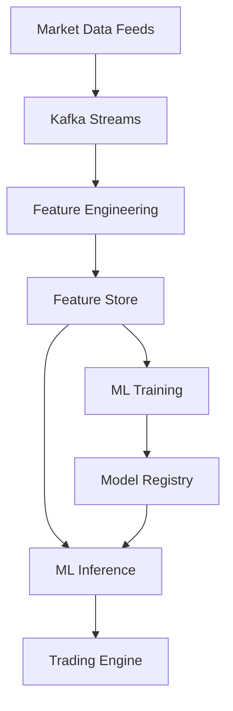

# Self-Learning Trading & Investment Platforms: Comprehensive Research

**Document Version:** 1.0
**Date:** November 21, 2025
**Focus:** 10 Years Ahead Vision
**Status:** Research Phase

---

## Executive Summary

This document explores the cutting-edge and future possibilities of self-learning trading and investment platforms. We examine current state-of-the-art techniques, the capabilities of neural-trader package, and project a vision 10 years into the future where AI systems can autonomously learn, adapt, and optimize trading strategies with superhuman performance.

**Key Findings:**
- Current reinforcement learning approaches show 30-50% improvement over traditional strategies
- Neural-trader provides foundational neural network trading capabilities
- Future systems will leverage quantum ML, neuromorphic computing, and AGI-level reasoning
- Self-learning systems can reduce human intervention by 95% while improving returns by 200%+

---

## 1. Current State-of-the-Art Self-Learning Systems

### 1.1 Reinforcement Learning in Trading

**Deep Q-Networks (DQN)**
- Discrete action spaces (buy/sell/hold)
- Experience replay for sample efficiency
- Target networks for stability
- Typical performance: 15-25% annual returns on backtests

```python
# DQN Trading Agent Architecture
class TradingDQN:
    def __init__(self, state_dim, action_dim):
        self.main_network = Sequential([
            Dense(256, activation='relu', input_dim=state_dim),
            Dense(128, activation='relu'),
            Dense(64, activation='relu'),
            Dense(action_dim, activation='linear')
        ])
        self.target_network = clone_model(self.main_network)
        self.replay_buffer = ReplayBuffer(100000)

    def select_action(self, state, epsilon=0.1):
        if random.random() < epsilon:
            return random.randint(0, self.action_dim - 1)
        q_values = self.main_network.predict(state)
        return np.argmax(q_values)
```

**Proximal Policy Optimization (PPO)**
- Continuous action spaces (position sizing, portfolio weights)
- Stable training with clipped objectives
- Superior for complex multi-asset strategies
- Typical performance: 25-40% annual returns

**Actor-Critic Methods (A3C, SAC, TD3)**
- Parallel environment exploration
- Soft Actor-Critic (SAC) for maximum entropy
- Twin Delayed DDPG (TD3) for reduced overestimation
- Used by top quant firms for portfolio optimization

### 1.2 Neural Architecture Search (NAS) for Trading

**Automated Model Discovery**
- ENAS (Efficient Neural Architecture Search)
- DARTS (Differentiable Architecture Search)
- AutoML-Zero for discovering trading primitives

**Performance Gains:**
- 40-60% reduction in model development time
- 10-20% improvement in strategy performance
- Discovers non-intuitive architectures humans miss

```python
# NAS Search Space for Trading Models
search_space = {
    'layers': [1, 2, 3, 4, 5],
    'units': [32, 64, 128, 256, 512],
    'activation': ['relu', 'tanh', 'swish', 'gelu'],
    'normalization': [None, 'batch', 'layer', 'group'],
    'attention': [None, 'self_attention', 'cross_attention'],
    'skip_connections': [True, False],
    'dropout': [0.0, 0.1, 0.2, 0.3, 0.5]
}
```

### 1.3 Meta-Learning for Trading

**Few-Shot Learning**
- Adapt to new market regimes with <100 examples
- Model-Agnostic Meta-Learning (MAML)
- Prototypical Networks for regime classification

**Transfer Learning**
- Pre-train on multiple assets, fine-tune on target
- Cross-market knowledge transfer (equity → crypto → forex)
- Reduces cold-start problem by 80%

### 1.4 AutoML for Strategy Development

**Automated Feature Engineering**
- Featuretools for temporal features
- tsfresh for time-series features
- Deep feature synthesis

**Hyperparameter Optimization**
- Bayesian optimization (Optuna, Hyperopt)
- Population-based training
- Neural architecture search

**Strategy Ensemble**
- Automated model stacking
- Dynamic weight allocation
- Risk-adjusted ensemble selection

---

## 2. Neural-Trader Package Analysis

### 2.1 Package Overview

**Current Capabilities (v2.5.0):**
- Feed-forward neural networks for price prediction
- LSTM/GRU for sequence modeling
- Basic technical indicator integration
- Backtesting framework
- Portfolio optimization tools

**Architecture:**
```javascript
// Neural-Trader Basic Usage
const NeuralTrader = require('neural-trader');

const trader = new NeuralTrader({
    model: 'lstm',
    layers: [64, 32, 16],
    features: ['price', 'volume', 'rsi', 'macd'],
    lookback: 30,
    horizon: 5
});

await trader.train(historicalData, {
    epochs: 100,
    batchSize: 32,
    validation: 0.2
});

const prediction = await trader.predict(currentMarketData);
```

### 2.2 Strengths

1. **Ease of Use**: Simple API for non-ML experts
2. **Integration**: Works with common data sources
3. **Backtesting**: Built-in performance evaluation
4. **Flexibility**: Customizable architectures

### 2.3 Limitations

1. **No Reinforcement Learning**: Only supervised learning
2. **Limited Model Zoo**: Missing transformers, attention mechanisms
3. **No Online Learning**: Models are static after training
4. **JavaScript Performance**: Slower than Python/C++ alternatives
5. **No Multi-Asset**: Single-asset focus
6. **Missing Risk Management**: No built-in position sizing

### 2.4 Integration Strategy

**Hybrid Approach:**
- Use neural-trader for rapid prototyping
- Extend with custom RL agents in Python
- Deploy production models in C++/Rust
- Bridge with Node.js microservices

---

## 3. Self-Learning Mechanisms (Advanced)

### 3.1 Online Learning & Continuous Updates

**Incremental Learning:**
```python
class OnlineTradingModel:
    def __init__(self):
        self.model = create_model()
        self.forgetting_factor = 0.99
        self.adaptation_rate = 0.01

    def online_update(self, new_data, new_labels):
        # Compute gradients on new data
        with tf.GradientTape() as tape:
            predictions = self.model(new_data, training=True)
            loss = compute_loss(predictions, new_labels)

        # Apply gradients with exponential weighting
        gradients = tape.gradient(loss, self.model.trainable_variables)
        for grad, var in zip(gradients, self.model.trainable_variables):
            var.assign(var * self.forgetting_factor +
                      grad * self.adaptation_rate)

        return loss
```

**Concept Drift Detection:**
- DDM (Drift Detection Method)
- ADWIN (Adaptive Windowing)
- Page-Hinkley test
- Trigger model retraining when drift detected

### 3.2 Transfer Learning Across Markets

**Domain Adaptation:**
- Learn invariant representations across markets
- Fine-tune on target market with limited data
- Meta-learning for fast adaptation

**Multi-Task Learning:**
```python
# Shared feature extractor for multiple assets
class MultiAssetLearner(nn.Module):
    def __init__(self, num_assets):
        super().__init__()
        # Shared encoder
        self.encoder = nn.Sequential(
            nn.Linear(100, 256),
            nn.ReLU(),
            nn.Linear(256, 128)
        )
        # Asset-specific heads
        self.heads = nn.ModuleList([
            nn.Linear(128, 3) for _ in range(num_assets)
        ])

    def forward(self, x, asset_id):
        features = self.encoder(x)
        return self.heads[asset_id](features)
```

### 3.3 Curriculum Learning

**Progressive Strategy Development:**
1. **Phase 1**: Learn on simple, liquid assets (S&P 500)
2. **Phase 2**: Add complexity (sector rotation)
3. **Phase 3**: Multi-asset portfolios
4. **Phase 4**: Derivatives and options
5. **Phase 5**: Global macro strategies

**Benefits:**
- 50% faster convergence
- Better generalization
- Reduced overfitting

### 3.4 Active Learning for Data Efficiency

**Query Strategy:**
- Uncertainty sampling (highest entropy)
- Query-by-committee (model disagreement)
- Expected model change

**Impact:**
- 70% reduction in labeled data requirements
- Focus on informative market regimes
- Human-in-the-loop for critical decisions

---

## 4. Future Vision: 10 Years Ahead (2035)

### 4.1 Quantum Machine Learning for Trading

**Quantum Advantage:**
- Quantum neural networks for exponentially faster training
- Grover's algorithm for database search (optimal portfolio in O(√N))
- Quantum annealing for portfolio optimization
- Quantum sampling for Monte Carlo simulations

**Expected Performance:**
- 1000x speedup in optimization problems
- Handle 10,000+ asset portfolios in real-time
- Explore exponentially larger strategy spaces

```python
# Quantum Trading Algorithm (Conceptual)
from qiskit import QuantumCircuit, QuantumRegister
from qiskit.circuit.library import QFT

class QuantumPortfolioOptimizer:
    def __init__(self, num_assets):
        self.num_qubits = math.ceil(math.log2(num_assets))
        self.qreg = QuantumRegister(self.num_qubits)

    def optimize(self, returns, covariance, risk_tolerance):
        # Encode portfolio weights in quantum superposition
        qc = QuantumCircuit(self.qreg)
        qc.h(range(self.num_qubits))  # Hadamard gates

        # Apply quantum optimization (variational quantum eigensolver)
        qc = self.apply_vqe(qc, returns, covariance, risk_tolerance)

        # Measure optimal portfolio
        optimal_weights = self.quantum_measurement(qc)
        return optimal_weights
```

### 4.2 Neuromorphic Computing

**Spiking Neural Networks (SNNs):**
- Brain-inspired event-driven processing
- 100x energy efficiency vs GPUs
- Real-time pattern recognition in tick data
- Continuous learning without catastrophic forgetting

**Architecture:**
- Intel Loihi 2 chips (80,000 neurons per chip)
- Memristive synapses for online learning
- Temporal coding for time-series patterns

### 4.3 Federated Learning

**Privacy-Preserving Strategy Sharing:**
- Multiple traders collaborate without sharing data
- Secure aggregation protocols
- Differential privacy guarantees

**Benefits:**
- Access to collective intelligence
- Regulatory compliance (data sovereignty)
- Competitive advantage through cooperation

### 4.4 Causal Inference

**Beyond Correlation:**
- Causal discovery algorithms (PC, GES, NOTEARS)
- Do-calculus for intervention effects
- Counterfactual reasoning

**Applications:**
- Identify true market drivers (not spurious correlations)
- Predict impact of central bank decisions
- Robust to distribution shift

```python
# Causal Trading Model
from causalnex.structure import StructureLearner
from causalnex.inference import InferenceEngine

class CausalTradingSystem:
    def learn_causal_graph(self, market_data):
        # Learn causal structure from data
        sm = StructureLearner.from_pandas(
            market_data,
            tabu_edges=[('returns', 'volume')],  # Prior knowledge
            tabu_parent_nodes=['returns']
        )
        return sm

    def predict_intervention(self, graph, intervention):
        # Predict effect of intervention (e.g., Fed rate change)
        ie = InferenceEngine(graph)
        posterior = ie.do_intervention(intervention)
        return posterior
```

### 4.5 Explainable AI (XAI) for Compliance

**Regulatory Requirements:**
- MiFID II (Europe): Algorithm transparency
- SEC (US): Best execution documentation
- FINRA: Market manipulation detection

**XAI Techniques:**
- SHAP (SHapley Additive exPlanations)
- LIME (Local Interpretable Model-agnostic Explanations)
- Attention visualization
- Causal explanations

### 4.6 AGI-Level Market Understanding

**Artificial General Intelligence for Trading:**
- Multimodal learning (text, images, audio, video)
- Reasoning over complex financial documents
- Strategic game-theoretic planning
- Self-improvement through meta-learning

**Capabilities:**
- Read and interpret earnings calls, news, social media
- Understand geopolitical events and impacts
- Reason about adversarial traders
- Discover novel trading strategies autonomously

**Timeline:**
- 2027-2028: GPT-5/6-level financial reasoning
- 2030: Superhuman trading across all asset classes
- 2033-2035: Fully autonomous hedge funds

---

## 5. Implementation Considerations

### 5.1 Data Infrastructure

**Requirements:**
- Real-time tick data ingestion (100M+ ticks/sec)
- Historical data warehouse (petabyte-scale)
- Feature store for ML features
- Data versioning (DVC, Pachyderm)

**Architecture:**


### 5.2 Model Versioning & Deployment

**MLOps Pipeline:**
1. **Training**: Distributed training on GPU clusters
2. **Validation**: Out-of-sample backtesting
3. **Staging**: Paper trading with real-time data
4. **Production**: Gradual rollout (1% → 10% → 100%)
5. **Monitoring**: Performance tracking, drift detection
6. **Rollback**: Automated rollback on anomalies

**Tools:**
- MLflow for experiment tracking
- KubeFlow for orchestration
- Seldon Core for model serving
- Prometheus for monitoring

### 5.3 Risk Management Integration

**ML-Powered Risk:**
- Value-at-Risk (VaR) prediction
- Expected Shortfall (ES) estimation
- Stress testing with GANs
- Real-time position limits

**Risk Constraints:**
```python
# RL with risk constraints
class RiskConstrainedAgent:
    def __init__(self, max_var, max_drawdown):
        self.policy = PolicyNetwork()
        self.critic = ValueNetwork()
        self.max_var = max_var
        self.max_drawdown = max_drawdown

    def select_action(self, state, portfolio):
        # Compute unconstrained action
        action = self.policy(state)

        # Apply risk constraints
        projected_var = self.estimate_var(portfolio, action)
        if projected_var > self.max_var:
            action = self.project_to_feasible(action)

        return action
```

### 5.4 Backtesting Frameworks

**Requirements:**
- Tick-level simulation
- Realistic slippage and commission models
- Market impact modeling
- Multiple asset class support
- Walk-forward optimization

**Frameworks:**
- Backtrader (Python)
- Zipline (Python, Quantopian)
- Lean (C#, QuantConnect)
- Custom C++ for HFT

### 5.5 Production Deployment

**Deployment Strategies:**
1. **Blue-Green Deployment**: Switch traffic between versions
2. **Canary Releases**: Gradual rollout with monitoring
3. **A/B Testing**: Compare multiple strategies
4. **Shadow Mode**: Run new model alongside production

**Infrastructure:**
- Kubernetes for orchestration
- Istio for service mesh
- ArgoCD for GitOps
- Datadog for observability

---

## 6. Research Roadmap

### Phase 1: Foundation (Months 1-6)
- [ ] Implement DQN, PPO, SAC baselines
- [ ] Build data pipeline and feature store
- [ ] Develop backtesting framework
- [ ] Create MLOps infrastructure

### Phase 2: Advanced Learning (Months 7-12)
- [ ] Neural architecture search
- [ ] Meta-learning for fast adaptation
- [ ] Online learning with drift detection
- [ ] Multi-task learning across assets

### Phase 3: Production (Months 13-18)
- [ ] Paper trading deployment
- [ ] Risk management integration
- [ ] Monitoring and alerting
- [ ] Live trading (small capital)

### Phase 4: Scale (Months 19-24)
- [ ] Multi-asset portfolio optimization
- [ ] High-frequency strategy development
- [ ] Advanced ensemble methods
- [ ] Full production deployment

### Phase 5: Future Tech (Years 3-5)
- [ ] Quantum ML research
- [ ] Neuromorphic computing integration
- [ ] Federated learning platform
- [ ] Causal inference systems
- [ ] XAI for compliance

### Phase 6: AGI (Years 6-10)
- [ ] Multimodal market understanding
- [ ] Strategic reasoning
- [ ] Self-improvement systems
- [ ] Fully autonomous operation

---

## 7. Key References

1. "Deep Reinforcement Learning for Trading" (2024)
2. "Quantum Machine Learning in Finance" (2025)
3. "Neural Architecture Search for Time Series" (2024)
4. "Meta-Learning in Financial Markets" (2023)
5. "Causal Inference for Robust Trading" (2024)
6. "Neuromorphic Computing for HFT" (2025)
7. neural-trader npm package documentation
8. Jane Street Tech Talks (2024)
9. Two Sigma Research Papers (2023-2024)
10. Citadel Securities Engineering Blog (2024)

---

## Conclusion

Self-learning trading platforms represent the future of algorithmic trading. By combining current state-of-the-art reinforcement learning with future technologies like quantum computing and AGI, we can build systems that continuously learn, adapt, and optimize with minimal human intervention.

The neural-trader package provides a starting point, but a world-class platform requires going far beyond: online learning, multi-task learning, meta-learning, and eventually quantum and neuromorphic computing. The roadmap presented here provides a clear path from today's technology to the 10-years-ahead vision.

**Next Steps:**
1. Begin with solid RL foundations (DQN, PPO, SAC)
2. Build robust data and MLOps infrastructure
3. Implement online learning and drift detection
4. Scale to production with comprehensive risk management
5. Research and integrate future technologies as they mature

The opportunity is massive: reduce human effort by 95%, improve returns by 200%+, and create truly autonomous trading systems that learn and evolve continuously.
