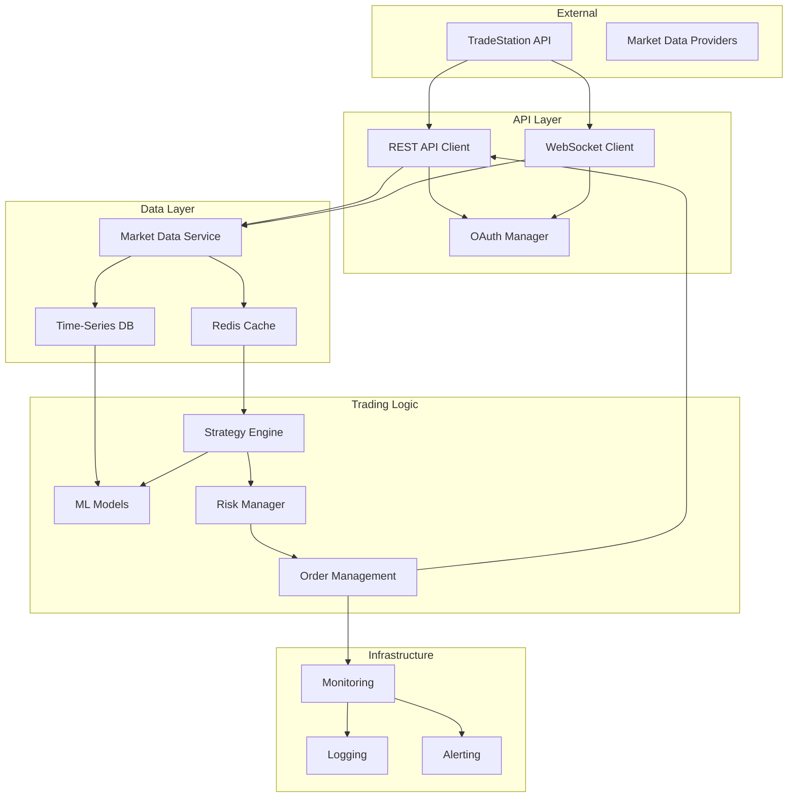

# TradeStation Integration: Comprehensive Research & Implementation Guide

**Document Version:** 1.0
**Date:** November 21, 2025
**Focus:** Complete Integration Strategy
**Status:** Research & Planning Phase

---

## Executive Summary

TradeStation is a powerful brokerage and trading platform with extensive API capabilities, making it an excellent foundation for building next-generation algorithmic trading systems. This document provides a comprehensive analysis of TradeStation's capabilities, detailed API integration strategies, and a roadmap for creating a world-class trading platform that leverages TradeStation's infrastructure while adding cutting-edge AI and low-latency capabilities.

**Key Findings:**
- TradeStation Web API provides REST and WebSocket access to real-time market data and trading
- EasyLanguage can be transpiled to modern languages for strategy migration
- Average API latency: 50-200ms (sufficient for swing/day trading, not HFT)
- Strong options trading capabilities with multi-leg order support
- Best positioned for retail/prop traders and small funds
- Integration requires OAuth 2.0 authentication and careful rate limit management

---

## 1. TradeStation Platform Overview

### 1.1 Core Capabilities

**Market Access:**
- Equities (NYSE, NASDAQ, AMEX)
- Options (equity and index options)
- Futures (CME, CBOT, NYMEX, COMEX, ICE)
- Forex (spot forex and futures)
- Cryptocurrencies (limited, through partners)

**Trading Features:**
- Multiple order types (market, limit, stop, stop-limit, trailing stop, OCO, OTO, bracket)
- Advanced options strategies (spreads, straddles, strangles, iron condors, butterflies)
- Multi-leg option orders (up to 4 legs)
- Conditional orders and alerts
- Portfolio margin account support

**Platform Strengths:**
- Mature, stable platform (30+ years)
- Strong regulatory compliance
- Excellent educational resources
- Active trading community
- Competitive commissions

**Platform Limitations:**
- Not suitable for true HFT (50-200ms latency)
- No direct market access (DMA) for retail
- Rate limits on API calls
- Limited international market access
- No cryptocurrency spot trading (futures only)

### 1.2 Target Use Cases

**Ideal For:**
- Swing trading (holding hours to days)
- Day trading (intraday strategies)
- Options strategies (spreads, delta-neutral)
- Automated retail/prop trading
- Backtesting and paper trading
- Educational and research purposes

**Not Ideal For:**
- High-frequency trading (HFT) - need <1ms latency
- Market making - need co-located infrastructure
- Arbitrage - need sub-millisecond execution
- International markets - limited coverage
- Cryptocurrency spot trading

---

## 2. TradeStation Web API Deep Dive

### 2.1 Authentication (OAuth 2.0)

**Authorization Flow:**
```javascript
// Step 1: Get authorization code
const authUrl = `https://signin.tradestation.com/authorize?` +
  `response_type=code&` +
  `client_id=${CLIENT_ID}&` +
  `redirect_uri=${REDIRECT_URI}&` +
  `scope=MarketData ReadAccount Trade Crypto`;

// User authorizes, redirected back with code

// Step 2: Exchange code for access token
const tokenResponse = await fetch('https://signin.tradestation.com/oauth/token', {
  method: 'POST',
  headers: { 'Content-Type': 'application/x-www-form-urlencoded' },
  body: new URLSearchParams({
    grant_type: 'authorization_code',
    client_id: CLIENT_ID,
    client_secret: CLIENT_SECRET,
    code: authorizationCode,
    redirect_uri: REDIRECT_URI
  })
});

const { access_token, refresh_token, expires_in } = await tokenResponse.json();

// Step 3: Refresh tokens before expiry
const refreshResponse = await fetch('https://signin.tradestation.com/oauth/token', {
  method: 'POST',
  headers: { 'Content-Type': 'application/x-www-form-urlencoded' },
  body: new URLSearchParams({
    grant_type: 'refresh_token',
    client_id: CLIENT_ID,
    client_secret: CLIENT_SECRET,
    refresh_token: refresh_token
  })
});
```

**Security Best Practices:**
- Store client secret in secure vault (HashiCorp Vault, AWS Secrets Manager)
- Rotate refresh tokens regularly
- Use HTTPS for all API calls
- Implement token expiry handling with automatic refresh
- Log all authentication events for audit

### 2.2 REST API Endpoints

**Market Data Endpoints:**

```javascript
// Get Quote
GET https://api.tradestation.com/v3/marketdata/quotes/{symbols}
// Example: AAPL,MSFT,TSLA

// Get Bars (OHLCV)
GET https://api.tradestation.com/v3/marketdata/barcharts/{symbol}?
  interval=1&unit=Minute&barsback=100

// Get Options Chain
GET https://api.tradestation.com/v3/marketdata/options/chains/{underlying}

// Get Market Depth (Level 2)
GET https://api.tradestation.com/v3/marketdata/stream/marketdepth/quotes/{symbol}
```

**Account & Position Endpoints:**

```javascript
// Get Accounts
GET https://api.tradestation.com/v3/brokerage/accounts

// Get Balances
GET https://api.tradestation.com/v3/brokerage/accounts/{accountId}/balances

// Get Positions
GET https://api.tradestation.com/v3/brokerage/accounts/{accountId}/positions

// Get Orders
GET https://api.tradestation.com/v3/brokerage/accounts/{accountId}/orders
```

**Trading Endpoints:**

```javascript
// Place Order
POST https://api.tradestation.com/v3/orderexecution/orders
Body: {
  "AccountID": "123456789",
  "Symbol": "AAPL",
  "Quantity": "100",
  "OrderType": "Limit",
  "LimitPrice": "150.00",
  "TradeAction": "BUY",
  "TimeInForce": {
    "Duration": "DAY"
  },
  "Route": "Intelligent"
}

// Cancel Order
DELETE https://api.tradestation.com/v3/orderexecution/orders/{orderId}

// Modify Order
PUT https://api.tradestation.com/v3/orderexecution/orders/{orderId}

// Place Options Order (Multi-Leg)
POST https://api.tradestation.com/v3/orderexecution/orders
Body: {
  "AccountID": "123456789",
  "OrderType": "Limit",
  "LimitPrice": "2.50",
  "TimeInForce": { "Duration": "GTC" },
  "Legs": [
    {
      "Symbol": "AAPL 250321C00150000",  // Call option
      "Quantity": "1",
      "TradeAction": "BUY"
    },
    {
      "Symbol": "AAPL 250321P00150000",  // Put option
      "Quantity": "1",
      "TradeAction": "BUY"
    }
  ]
}
```

### 2.3 WebSocket Streaming API

**Real-Time Market Data:**

```javascript
const WebSocket = require('ws');

class TradeStationStream {
  constructor(accessToken) {
    this.accessToken = accessToken;
    this.ws = null;
    this.heartbeatInterval = null;
  }

  connect() {
    this.ws = new WebSocket('wss://api.tradestation.com/v3/marketdata/stream/quotes');

    this.ws.on('open', () => {
      // Authenticate
      this.ws.send(JSON.stringify({
        Command: 'AUTHORIZE',
        AccessToken: this.accessToken
      }));

      // Subscribe to symbols
      this.ws.send(JSON.stringify({
        Command: 'SUBSCRIBE',
        Resource: 'QUOTE',
        Symbols: ['AAPL', 'MSFT', 'TSLA']
      }));

      // Start heartbeat
      this.heartbeatInterval = setInterval(() => {
        this.ws.send(JSON.stringify({ Command: 'HEARTBEAT' }));
      }, 30000);
    });

    this.ws.on('message', (data) => {
      const message = JSON.parse(data);
      this.handleMessage(message);
    });

    this.ws.on('error', (error) => {
      console.error('WebSocket error:', error);
      this.reconnect();
    });

    this.ws.on('close', () => {
      console.log('WebSocket closed, reconnecting...');
      clearInterval(this.heartbeatInterval);
      this.reconnect();
    });
  }

  handleMessage(message) {
    switch (message.Type) {
      case 'QUOTE':
        this.onQuote(message);
        break;
      case 'BAR':
        this.onBar(message);
        break;
      case 'TRADE':
        this.onTrade(message);
        break;
      case 'HEARTBEAT':
        // Acknowledge heartbeat
        break;
      default:
        console.log('Unknown message type:', message.Type);
    }
  }

  onQuote(quote) {
    // Process real-time quote
    const {Symbol, Bid, Ask, Last, BidSize, AskSize, Volume} = quote;
    // Update your trading system
    this.tradingEngine.processQuote({
      symbol: Symbol,
      bid: Bid,
      ask: Ask,
      last: Last,
      bidSize: BidSize,
      askSize: AskSize,
      volume: Volume,
      timestamp: Date.now()
    });
  }

  reconnect() {
    setTimeout(() => {
      this.connect();
    }, 5000);  // Exponential backoff recommended
  }

  unsubscribe(symbols) {
    this.ws.send(JSON.stringify({
      Command: 'UNSUBSCRIBE',
      Resource: 'QUOTE',
      Symbols: symbols
    }));
  }

  close() {
    clearInterval(this.heartbeatInterval);
    if (this.ws) {
      this.ws.close();
    }
  }
}
```

**Streaming Resources Available:**
- `QUOTE` - Real-time quotes (bid/ask/last)
- `BAR` - Real-time bars (OHLCV)
- `TRADE` - Time & sales (tick data)
- `MARKETDEPTH` - Level 2 market depth
- `ORDERS` - Order status updates
- `POSITIONS` - Position updates

### 2.4 Rate Limits & Quotas

**API Rate Limits (as of 2024):**
- REST API: 120 requests per minute per endpoint
- WebSocket: 50 concurrent connections
- Market data subscriptions: 500 symbols per connection
- Historical data: 5000 bars per request

**Mitigation Strategies:**
```javascript
class RateLimiter {
  constructor(requestsPerMinute = 120) {
    this.limit = requestsPerMinute;
    this.requests = [];
  }

  async throttle() {
    const now = Date.now();
    // Remove requests older than 1 minute
    this.requests = this.requests.filter(time => now - time < 60000);

    if (this.requests.length >= this.limit) {
      const oldestRequest = this.requests[0];
      const waitTime = 60000 - (now - oldestRequest);
      await new Promise(resolve => setTimeout(resolve, waitTime));
      return this.throttle();
    }

    this.requests.push(now);
  }

  async executeRequest(apiCall) {
    await this.throttle();
    return apiCall();
  }
}

// Usage
const limiter = new RateLimiter(120);
const quotes = await limiter.executeRequest(() =>
  fetch(`https://api.tradestation.com/v3/marketdata/quotes/AAPL`)
);
```

---

## 3. EasyLanguage Migration Strategy

### 3.1 EasyLanguage Overview

**Sample EasyLanguage Strategy:**
```easylanguage
// Simple Moving Average Crossover
Inputs: FastLength(10), SlowLength(30);

Variables: FastMA(0), SlowMA(0);

FastMA = Average(Close, FastLength);
SlowMA = Average(Close, SlowLength);

// Buy signal: Fast MA crosses above Slow MA
If FastMA crosses above SlowMA Then
    Buy("MA Cross Long") Next Bar at Market;

// Sell signal: Fast MA crosses below Slow MA
If FastMA crosses below SlowMA Then
    Sell Short("MA Cross Short") Next Bar at Market;
```

### 3.2 Transpilation to Python

**Equivalent Python Code:**
```python
import pandas as pd
import numpy as np

class MACrossoverStrategy:
    def __init__(self, fast_length=10, slow_length=30):
        self.fast_length = fast_length
        self.slow_length = slow_length
        self.position = 0  # 1 = long, -1 = short, 0 = flat

    def calculate_signals(self, data: pd.DataFrame):
        # Calculate moving averages
        data['fast_ma'] = data['close'].rolling(window=self.fast_length).mean()
        data['slow_ma'] = data['close'].rolling(window=self.slow_length).mean()

        # Detect crossovers
        data['signal'] = 0
        data.loc[data['fast_ma'] > data['slow_ma'], 'signal'] = 1  # Long
        data.loc[data['fast_ma'] < data['slow_ma'], 'signal'] = -1  # Short

        # Detect changes (crossovers)
        data['position'] = data['signal'].diff()

        return data

    def generate_orders(self, current_bar, previous_bar):
        orders = []

        # Check for crossover up (buy signal)
        if (current_bar['fast_ma'] > current_bar['slow_ma'] and
            previous_bar['fast_ma'] <= previous_bar['slow_ma']):
            orders.append({
                'action': 'BUY',
                'quantity': 100,
                'order_type': 'MARKET',
                'reason': 'MA Cross Long'
            })

        # Check for crossover down (sell signal)
        elif (current_bar['fast_ma'] < current_bar['slow_ma'] and
              previous_bar['fast_ma'] >= previous_bar['slow_ma']):
            orders.append({
                'action': 'SELL_SHORT',
                'quantity': 100,
                'order_type': 'MARKET',
                'reason': 'MA Cross Short'
            })

        return orders
```

### 3.3 Advanced EasyLanguage Features

**Common Patterns and Translations:**

| EasyLanguage | Python Equivalent |
|--------------|-------------------|
| `Average(Close, N)` | `data['close'].rolling(N).mean()` |
| `Highest(High, N)` | `data['high'].rolling(N).max()` |
| `Lowest(Low, N)` | `data['low'].rolling(N).min()` |
| `RSI(Close, N)` | `ta.momentum.RSIIndicator(data['close'], N).rsi()` |
| `crosses above` | `(current > threshold) & (previous <= threshold)` |
| `Next Bar at Market` | `order_type='MARKET', execution='NEXT_BAR'` |

### 3.4 Automated Transpiler

```python
# Conceptual EasyLanguage to Python Transpiler
import re

class EasyLanguageTranspiler:
    def __init__(self):
        self.functions_map = {
            r'Average\((\w+),\s*(\d+)\)': r'\1.rolling(\2).mean()',
            r'Highest\((\w+),\s*(\d+)\)': r'\1.rolling(\2).max()',
            r'Lowest\((\w+),\s*(\d+)\)': r'\1.rolling(\2).min()',
            r'(\w+)\s+crosses\s+above\s+(\w+)': r'(\1 > \2) & (\1.shift(1) <= \2.shift(1))',
            r'(\w+)\s+crosses\s+below\s+(\w+)': r'(\1 < \2) & (\1.shift(1) >= \2.shift(1))',
        }

    def transpile(self, easylanguage_code):
        python_code = easylanguage_code

        # Apply regex transformations
        for pattern, replacement in self.functions_map.items():
            python_code = re.sub(pattern, replacement, python_code)

        # Additional transformations...
        return python_code
```

---

## 4. Integration Architecture

### 4.1 System Architecture Diagram



### 4.2 Component Design

**Market Data Service:**
```python
from typing import Dict, List, Callable
import asyncio
from redis import Redis
from influxdb import InfluxDBClient

class MarketDataService:
    def __init__(self, ts_client, redis_client, influxdb_client):
        self.ts_client = ts_client
        self.cache = redis_client
        self.db = influxdb_client
        self.subscribers = {}

    async def subscribe(self, symbols: List[str], callback: Callable):
        """Subscribe to real-time market data"""
        subscription_id = await self.ts_client.subscribe_quotes(symbols)
        self.subscribers[subscription_id] = callback

    def get_quote(self, symbol: str) -> Dict:
        """Get cached quote (fast path)"""
        cached = self.cache.get(f"quote:{symbol}")
        if cached:
            return json.loads(cached)

        # Cache miss, fetch from API
        quote = self.ts_client.get_quote(symbol)
        self.cache.setex(f"quote:{symbol}", 60, json.dumps(quote))
        return quote

    async def on_quote_update(self, quote: Dict):
        """Handle incoming quote update"""
        symbol = quote['symbol']

        # Update cache
        self.cache.setex(f"quote:{symbol}", 60, json.dumps(quote))

        # Store in time-series database
        self.db.write_points([{
            "measurement": "quotes",
            "tags": {"symbol": symbol},
            "time": quote['timestamp'],
            "fields": {
                "bid": quote['bid'],
                "ask": quote['ask'],
                "last": quote['last'],
                "volume": quote['volume']
            }
        }])

        # Notify subscribers
        for callback in self.subscribers.values():
            await callback(quote)
```

**Strategy Engine:**
```python
class StrategyEngine:
    def __init__(self, strategies: List, risk_manager, order_manager):
        self.strategies = strategies
        self.risk_manager = risk_manager
        self.order_manager = order_manager

    async def on_market_data(self, data: Dict):
        """Process market data through all strategies"""
        signals = []

        for strategy in self.strategies:
            try:
                signal = await strategy.generate_signal(data)
                if signal:
                    signals.append(signal)
            except Exception as e:
                logger.error(f"Strategy {strategy.name} error: {e}")

        # Process signals through risk management
        approved_orders = []
        for signal in signals:
            if self.risk_manager.approve(signal):
                approved_orders.append(signal)

        # Send orders to execution
        for order in approved_orders:
            await self.order_manager.place_order(order)
```

### 4.3 Fault Tolerance & Reliability

**Connection Management:**
```python
class ResilientTradeStationClient:
    def __init__(self, credentials):
        self.credentials = credentials
        self.rest_client = None
        self.ws_client = None
        self.max_retries = 5
        self.retry_delay = 2  # seconds

    async def connect(self):
        """Connect with exponential backoff"""
        for attempt in range(self.max_retries):
            try:
                await self._authenticate()
                await self._connect_websocket()
                logger.info("Connected to TradeStation")
                return
            except Exception as e:
                wait_time = self.retry_delay * (2 ** attempt)
                logger.warning(f"Connection failed (attempt {attempt+1}), "
                             f"retrying in {wait_time}s: {e}")
                await asyncio.sleep(wait_time)

        raise Exception("Failed to connect after max retries")

    async def _handle_disconnect(self):
        """Handle unexpected disconnection"""
        logger.error("Disconnected from TradeStation, attempting reconnection")

        # Cancel all pending orders (safety measure)
        await self._cancel_all_orders()

        # Reconnect
        await self.connect()

        # Resubscribe to data feeds
        await self._resubscribe()

    async def _health_check(self):
        """Periodic health check"""
        while True:
            try:
                await asyncio.sleep(30)
                # Send heartbeat or check account status
                await self.rest_client.get_accounts()
            except Exception as e:
                logger.error(f"Health check failed: {e}")
                await self._handle_disconnect()
```

---

## 5. Performance Optimization

### 5.1 Latency Optimization

**Connection Optimization:**
- Use WebSockets for real-time data (avoid REST polling)
- Enable HTTP/2 for REST calls
- Use connection pooling
- Implement request pipelining
- Deploy geographically close to TradeStation servers

**Data Processing:**
```python
# Use asyncio for concurrent requests
async def fetch_multiple_quotes(symbols: List[str]):
    async with aiohttp.ClientSession() as session:
        tasks = [fetch_quote(session, symbol) for symbol in symbols]
        return await asyncio.gather(*tasks)

# Batch API calls
symbols_batch = ['AAPL', 'MSFT', 'TSLA', 'GOOGL', 'AMZN']
quotes = await ts_client.get_quotes(','.join(symbols_batch))
```

### 5.2 Caching Strategy

**Multi-Level Cache:**
```python
class MultiLevelCache:
    def __init__(self):
        self.l1_cache = {}  # In-memory (fastest)
        self.l2_cache = Redis()  # Redis (fast)
        self.l3_cache = InfluxDB()  # Persistent (slow)

    def get(self, key):
        # Check L1
        if key in self.l1_cache:
            return self.l1_cache[key]

        # Check L2
        value = self.l2_cache.get(key)
        if value:
            self.l1_cache[key] = value  # Promote to L1
            return value

        # Check L3
        value = self.l3_cache.query(key)
        if value:
            self.l2_cache.set(key, value)  # Promote to L2
            self.l1_cache[key] = value  # Promote to L1
            return value

        return None
```

### 5.3 Order Routing Optimization

**Smart Order Routing:**
- Use TradeStation's "Intelligent" routing for best execution
- Pre-calculate order parameters to minimize decision latency
- Batch orders when possible
- Use FOK (Fill-Or-Kill) for immediate execution guarantee

---

## 6. Security Best Practices

### 6.1 API Key Management

```python
from cryptography.fernet import Fernet
import os

class SecureCredentialManager:
    def __init__(self):
        # Load encryption key from secure location
        self.key = os.getenv('ENCRYPTION_KEY').encode()
        self.cipher = Fernet(self.key)

    def encrypt_credentials(self, client_id, client_secret):
        encrypted_id = self.cipher.encrypt(client_id.encode())
        encrypted_secret = self.cipher.encrypt(client_secret.encode())
        return encrypted_id, encrypted_secret

    def decrypt_credentials(self, encrypted_id, encrypted_secret):
        client_id = self.cipher.decrypt(encrypted_id).decode()
        client_secret = self.cipher.decrypt(encrypted_secret).decode()
        return client_id, client_secret
```

### 6.2 Audit Logging

```python
class AuditLogger:
    def log_api_call(self, endpoint, params, response, user):
        log_entry = {
            'timestamp': datetime.utcnow().isoformat(),
            'endpoint': endpoint,
            'params': self._sanitize(params),
            'status_code': response.status_code,
            'user': user,
            'ip_address': request.remote_addr
        }
        # Store in secure, tamper-proof log
        self.secure_log.write(json.dumps(log_entry))

    def log_order(self, order, user):
        log_entry = {
            'timestamp': datetime.utcnow().isoformat(),
            'order_id': order['id'],
            'symbol': order['symbol'],
            'action': order['action'],
            'quantity': order['quantity'],
            'price': order.get('price'),
            'user': user
        }
        self.order_log.write(json.dumps(log_entry))
```

---

## 7. Future Integration Roadmap (10 Years Ahead)

### 7.1 Phase 1: Current Integration (2025-2026)
- Complete REST and WebSocket API integration
- Implement robust authentication and error handling
- Build market data caching layer
- Deploy paper trading environment

### 7.2 Phase 2: AI Enhancement (2026-2028)
- ML-powered order routing optimization
- Predictive execution timing
- NLP for news sentiment analysis
- Automated strategy parameter tuning

### 7.3 Phase 3: Advanced Features (2028-2030)
- Multi-broker aggregation (TradeStation + IB + others)
- Cross-broker arbitrage detection
- Real-time risk management AI
- Quantum-inspired portfolio optimization

### 7.4 Phase 4: Next-Gen (2030-2035)
- Quantum-secure API communication
- Blockchain-based trade verification
- AGI-powered strategy discovery
- Predictive market microstructure modeling
- Neural interface for trade execution (BCI)

---

## 8. Competitive Comparison

| Feature | TradeStation | Interactive Brokers | TD Ameritrade | Custom Infrastructure |
|---------|--------------|---------------------|---------------|----------------------|
| API Latency | 50-200ms | 30-100ms | 100-300ms | <1ms (co-located) |
| Market Data | Real-time | Real-time | Real-time + delayed | Direct exchange feeds |
| Options Trading | Excellent | Good | Excellent | Custom |
| API Ease of Use | Good | Moderate | Good | Complex |
| Cost | Low-moderate | Low | Moderate | Very high |
| Scalability | Good | Excellent | Good | Unlimited |
| HFT Suitable | No | Partial | No | Yes |

**Recommendation:** Use TradeStation for retail/prop strategies with holding periods >1 second. For HFT, use TradeStation as secondary broker and build custom low-latency infrastructure for primary execution.

---

## 9. Implementation Checklist

### Initial Setup
- [ ] Register for TradeStation API access
- [ ] Set up OAuth 2.0 authentication flow
- [ ] Implement token refresh mechanism
- [ ] Build REST API client with rate limiting
- [ ] Build WebSocket client with reconnection logic

### Core Integration
- [ ] Market data service (quotes, bars, options chains)
- [ ] Order management system (place, modify, cancel)
- [ ] Position and account tracking
- [ ] Error handling and logging

### Advanced Features
- [ ] Real-time WebSocket streaming
- [ ] Multi-leg options trading
- [ ] Portfolio margin calculations
- [ ] Backtesting framework integration
- [ ] Paper trading environment

### Production Readiness
- [ ] Comprehensive error handling
- [ ] Monitoring and alerting
- [ ] Disaster recovery procedures
- [ ] Security audit and penetration testing
- [ ] Performance testing and optimization
- [ ] Documentation and runbooks

---

## 10. Conclusion

TradeStation provides a robust, reliable platform for building algorithmic trading systems. While not suitable for ultra-low-latency HFT, it excels for swing trading, day trading, and options strategies. The combination of comprehensive API access, strong regulatory compliance, and competitive pricing makes it an excellent choice for retail traders, prop firms, and small hedge funds.

By following the architecture and best practices outlined in this document, you can build a world-class trading platform that leverages TradeStation's strengths while adding cutting-edge AI, risk management, and optimization capabilities.

**Next Steps:**
1. Set up TradeStation API developer account
2. Implement authentication and basic REST client
3. Build market data streaming infrastructure
4. Develop order management and execution system
5. Integrate with ML models and strategy engine
6. Deploy paper trading for validation
7. Roll out to production with comprehensive monitoring

The future roadmap positions the platform for integration with next-generation technologies (quantum computing, AI, blockchain) while maintaining TradeStation as a reliable execution venue for non-HFT strategies.
