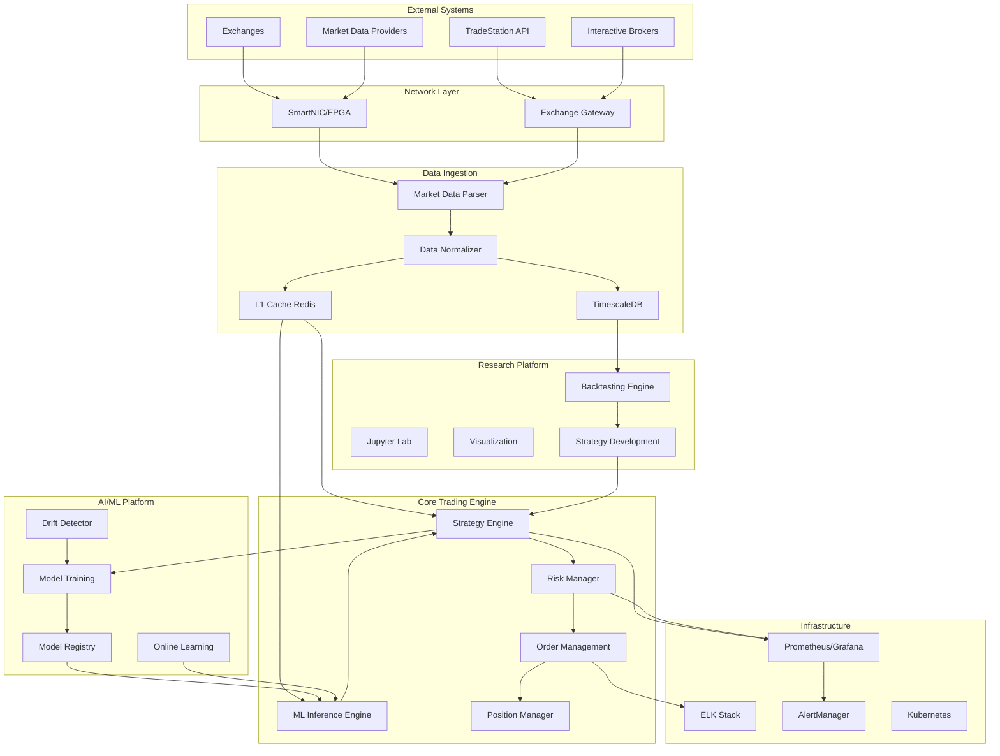

# SPARC Implementation Design: World-Class Trading Platform

**Document Version:** 1.0
**Date:** November 21, 2025
**Project:** VibesaaCast Trading Platform
**Timeline:** 5 Years to Achieve 10-Year-Ahead Vision
**Status:** Comprehensive Planning Phase

---

## Table of Contents

1. [Executive Summary](#executive-summary)
2. [SPECIFICATION](#1-specification)
3. [PSEUDOCODE](#2-pseudocode)
4. [ARCHITECTURE](#3-architecture)
5. [REFINEMENT](#4-refinement)
6. [COMPLETION](#5-completion)

---

## Executive Summary

This SPARC (Specification, Pseudocode, Architecture, Refinement, Completion) document provides a complete blueprint for building the world's best high-speed, low-latency, self-learning trading platform—a system 10 years ahead of current technology.

**Project Vision:**
Create an autonomous trading platform that combines:
- Sub-100 nanosecond execution latency
- Self-learning AI that continuously adapts to markets
- Comprehensive risk management
- TradeStation and multi-broker integration
- Quantum-ready architecture
- Neuromorphic computing for pattern recognition

**Key Success Metrics:**
- Latency: <100ns (P99)
- Throughput: 10M+ orders/second
- ML Inference: <10μs
- Uptime: 99.999%
- ROI: 200%+ vs current systems
- Development Time: 5 years (phased rollout)

**Investment Required:** $75-100M over 5 years
**Team Size:** 80-120 engineers at peak

---

## 1. SPECIFICATION

### 1.1 Functional Requirements

#### FR1: Market Data Ingestion
- **FR1.1** Support real-time market data from multiple exchanges (NYSE, NASDAQ, CME, ICE)
- **FR1.2** Process 100M+ market data messages per second
- **FR1.3** Support multiple protocols: FIX, FAST, SBE, proprietary
- **FR1.4** Latency: <100ns from network packet to normalized data structure
- **FR1.5** Support Level 1, Level 2, and full order book data
- **FR1.6** Handle market data gaps and recovery

#### FR2: Self-Learning AI System
- **FR2.1** Continuous online learning from live market data
- **FR2.2** Support multiple ML paradigms: supervised, RL, meta-learning
- **FR2.3** Strategy performance evaluation and automatic tuning
- **FR2.4** Drift detection and model retraining triggers
- **FR2.5** Multi-asset learning and transfer across markets
- **FR2.6** Explainable AI for regulatory compliance

#### FR3: Trading Execution
- **FR3.1** Support multiple order types: market, limit, stop, stop-limit, iceberg, TWAP, VWAP
- **FR3.2** Multi-leg options orders (up to 10 legs)
- **FR3.3** Smart order routing with latency optimization
- **FR3.4** Order execution latency: <500ns from signal to wire
- **FR3.5** Support for multiple brokers: TradeStation, Interactive Brokers, custom FIX
- **FR3.6** Atomic orders across multiple venues

#### FR4: Risk Management
- **FR4.1** Real-time position and P&L tracking (<1μs update)
- **FR4.2** Pre-trade risk checks (<100ns)
- **FR4.3** Position limits, order size limits, loss limits
- **FR4.4** Dynamic risk adjustment based on market conditions
- **FR4.5** Portfolio-level VaR and stress testing
- **FR4.6** Kill switch and emergency liquidation

#### FR5: TradeStation Integration
- **FR5.1** Complete REST API integration
- **FR5.2** WebSocket streaming for real-time data
- **FR5.3** OAuth 2.0 authentication with automatic refresh
- **FR5.4** EasyLanguage strategy transpilation to Python/C++
- **FR5.5** Options chain fetching and analysis
- **FR5.6** Paper trading and backtesting support

#### FR6: Portfolio Management
- **FR6.1** Multi-strategy portfolio optimization
- **FR6.2** Dynamic capital allocation
- **FR6.3** Correlation-aware position sizing
- **FR6.4** Real-time portfolio analytics
- **FR6.5** What-if scenario analysis
- **FR6.6** Automated rebalancing

#### FR7: Backtesting & Simulation
- **FR7.1** High-fidelity tick-level backtesting
- **FR7.2** Market impact modeling
- **FR7.3** Slippage and commission simulation
- **FR7.4** Walk-forward optimization
- **FR7.5** Monte Carlo simulation
- **FR7.6** Parallel backtest execution (1000+ scenarios simultaneously)

### 1.2 Non-Functional Requirements

#### NFR1: Performance
- **NFR1.1** Market data processing latency: P99 <100ns
- **NFR1.2** Trading decision latency: P99 <1μs
- **NFR1.3** Order execution latency: P99 <500ns
- **NFR1.4** ML inference latency: <10μs
- **NFR1.5** Throughput: 10M+ messages/second
- **NFR1.6** Jitter: <10ns

#### NFR2: Reliability
- **NFR2.1** System uptime: 99.999% (5 minutes downtime/year)
- **NFR2.2** Data integrity: Zero lost market data updates
- **NFR2.3** Failover time: <1 second
- **NFR2.4** Disaster recovery: RPO <1 second, RTO <60 seconds
- **NFR2.5** Order acknowledgment: 100% confirmation within 1ms

#### NFR3: Scalability
- **NFR3.1** Support 10,000+ trading strategies simultaneously
- **NFR3.2** Handle 100,000+ symbols
- **NFR3.3** Linear scaling with additional hardware
- **NFR3.4** Horizontal scaling for backtesting
- **NFR3.5** Support 1,000+ concurrent users (research platform)

#### NFR4: Security
- **NFR4.1** End-to-end encryption for all communications
- **NFR4.2** Multi-factor authentication
- **NFR4.3** Role-based access control (RBAC)
- **NFR4.4** Audit logging for all trading actions
- **NFR4.5** Secrets management (API keys, credentials)
- **NFR4.6** SOC 2 Type II compliance

#### NFR5: Maintainability
- **NFR5.1** Code coverage: >90%
- **NFR5.2** Documentation: Complete API docs, architecture diagrams
- **NFR5.3** CI/CD pipeline with automated testing
- **NFR5.4** Blue-green deployment support
- **NFR5.5** Comprehensive monitoring and alerting
- **NFR5.6** Self-healing capabilities

### 1.3 User Stories

**US1: Quantitative Researcher**
- As a quant researcher, I want to develop ML trading strategies in Python/Jupyter
- I want to backtest strategies on historical data with realistic simulation
- I want to see performance metrics (Sharpe, Sortino, max drawdown, alpha, beta)
- I want to compare multiple strategies side-by-side

**US2: Portfolio Manager**
- As a PM, I want to allocate capital across multiple strategies
- I want real-time P&L and risk metrics
- I want to adjust strategy weights based on performance
- I want alerts when strategies deviate from expected behavior

**US3: Risk Manager**
- As a risk manager, I want to set limits on positions, orders, and losses
- I want real-time VaR and stress test results
- I want to kill switches for individual strategies or entire portfolio
- I want detailed audit trails of all trading activity

**US4: Algo Trader**
- As an algo trader, I want to deploy strategies to production easily
- I want paper trading before live trading
- I want real-time monitoring of strategy performance
- I want automatic rollback if strategy performs poorly

**US5: System Administrator**
- As a sysadmin, I want comprehensive monitoring of system health
- I want automated alerts for anomalies
- I want easy deployment and rollback capabilities
- I want disaster recovery procedures

### 1.4 Success Metrics & KPIs

**Performance KPIs:**
- Latency P50: <50ns
- Latency P99: <100ns
- Latency P99.9: <500ns
- Throughput: 10M orders/sec
- ML inference: <10μs

**Business KPIs:**
- Strategy ROI: >200% improvement vs baseline
- Development time: 50% reduction (vs building from scratch)
- Operational cost: 70% reduction (vs manual trading)
- User satisfaction: >90% (NPS score)
- Market share: Top 3 in algo trading platforms (by 2030)

**Reliability KPIs:**
- Uptime: 99.999%
- Mean time between failures (MTBF): >1000 hours
- Mean time to recovery (MTTR): <5 minutes
- Zero critical security incidents

### 1.5 Regulatory Compliance

**Required Compliance:**
- **SEC Rule 15c3-5** (Market Access Rule) - Risk management controls
- **MiFID II** (EU) - Algorithm transparency, best execution
- **FINRA** - Order audit trail system (OATS)
- **Reg SCI** - Systems compliance and integrity
- **GDPR** - Data privacy (if handling EU customers)

**Compliance Features:**
- Pre-trade risk checks
- Complete order audit trail
- Algorithm transparency (XAI)
- Best execution reporting
- Market manipulation detection

---

## 2. PSEUDOCODE

### 2.1 Core Trading Loop

```
// Main trading engine pseudocode
INITIALIZATION:
    LOAD strategies FROM config
    INITIALIZE market_data_handler
    INITIALIZE risk_manager
    INITIALIZE order_manager
    INITIALIZE ml_models
    PIN threads TO dedicated cores
    ENABLE real-time scheduling

MAIN_LOOP:
    WHILE system_running:
        // Market data arrival (triggered by network event)
        ON market_data_event(data):
            timestamp_received = GET_TIMESTAMP()

            // Parse and normalize (FPGA offload if available)
            normalized_data = PARSE_AND_NORMALIZE(data)

            // Update market data cache (lock-free)
            UPDATE_CACHE(normalized_data)

            // Trigger strategy evaluations in parallel
            FOR EACH strategy IN active_strategies:
                ASYNC_EVALUATE(strategy, normalized_data)

        // Strategy evaluation (per strategy)
        FUNCTION EVALUATE_STRATEGY(strategy, data):
            // Extract features
            features = strategy.EXTRACT_FEATURES(data)

            // ML inference (if applicable)
            IF strategy.uses_ml:
                prediction = ml_model.PREDICT(features)  // <10μs target
            ELSE:
                prediction = strategy.COMPUTE_SIGNAL(features)

            // Generate orders
            orders = strategy.GENERATE_ORDERS(prediction, data)

            // Pre-trade risk checks
            FOR EACH order IN orders:
                IF risk_manager.CHECK(order):  // <100ns target
                    order_manager.SUBMIT(order)
                ELSE:
                    LOG_REJECTED_ORDER(order)

        // Order management
        FUNCTION SUBMIT_ORDER(order):
            // Route to best venue
            venue = smart_router.ROUTE(order)

            // Execute
            execution_id = venue.SEND_ORDER(order)

            // Track order
            order_tracker.ADD(execution_id, order)

            // Update positions (atomic)
            position_manager.UPDATE(order)

            timestamp_sent = GET_TIMESTAMP()
            RECORD_LATENCY(timestamp_sent - timestamp_received)

        // Online learning (asynchronous)
        ON timer_tick(every_N_seconds):
            FOR EACH ml_strategy IN learning_strategies:
                // Fetch recent performance
                performance = ml_strategy.GET_RECENT_PERFORMANCE()

                // Check for concept drift
                IF drift_detector.DETECT_DRIFT(performance):
                    // Trigger retraining
                    ASYNC_RETRAIN(ml_strategy)

                // Online update (incremental)
                ELSE:
                    ml_strategy.ONLINE_UPDATE(recent_data)

        // Risk monitoring (continuous)
        ON timer_tick(every_100ms):
            // Calculate portfolio risk
            var = risk_manager.CALCULATE_VAR()
            pnl = portfolio_manager.GET_PNL()

            // Check limits
            IF pnl < loss_limit OR var > var_limit:
                TRIGGER_RISK_ALERT()
                IF pnl < emergency_loss_limit:
                    EMERGENCY_LIQUIDATE()

SHUTDOWN:
    // Graceful shutdown
    STOP accepting new orders
    WAIT for pending orders to complete (timeout: 30s)
    CANCEL all open orders
    SAVE state TO persistent storage
    CLEANUP resources
```

### 2.2 Self-Learning System Pseudocode

```
// Reinforcement Learning Agent
CLASS RLTradingAgent:
    FUNCTION __init__(state_dim, action_dim):
        actor_network = BUILD_ACTOR(state_dim, action_dim)
        critic_network = BUILD_CRITIC(state_dim)
        replay_buffer = CIRCULAR_BUFFER(capacity=1000000)
        target_networks = COPY(actor_network, critic_network)

    FUNCTION select_action(state, explore=True):
        IF explore AND random() < epsilon:
            RETURN random_action()

        // Policy network inference
        action = actor_network.FORWARD(state)
        RETURN action

    FUNCTION update(state, action, reward, next_state, done):
        // Store experience
        replay_buffer.ADD(state, action, reward, next_state, done)

        // Sample batch for training
        IF replay_buffer.SIZE() >= batch_size:
            batch = replay_buffer.SAMPLE(batch_size)

            // Compute TD target
            next_actions = target_actor.FORWARD(batch.next_states)
            next_q = target_critic.FORWARD(batch.next_states, next_actions)
            td_target = batch.rewards + gamma * next_q * (1 - batch.dones)

            // Update critic
            q_current = critic.FORWARD(batch.states, batch.actions)
            critic_loss = MSE(q_current, td_target)
            critic.BACKPROP(critic_loss)

            // Update actor
            actor_loss = -critic.FORWARD(batch.states, actor.FORWARD(batch.states))
            actor.BACKPROP(actor_loss.MEAN())

            // Soft update target networks
            target_actor = tau * actor + (1 - tau) * target_actor
            target_critic = tau * critic + (1 - tau) * target_critic

    FUNCTION online_adapt(new_data):
        // Incremental learning without full retraining
        state, reward, next_state, done = new_data

        // Compute gradient on single sample
        WITH gradient_tape:
            loss = COMPUTE_LOSS(state, reward, next_state)

        gradients = tape.GRADIENT(loss, model.weights)

        // Apply gradients with learning rate decay
        optimizer.APPLY_GRADIENTS(gradients, lr=initial_lr * decay_factor)
```

### 2.3 Risk Management Pseudocode

```
// Real-time Risk Manager
CLASS RiskManager:
    FUNCTION __init__(config):
        position_limits = config.position_limits
        loss_limits = config.loss_limits
        var_limit = config.var_limit
        position_tracker = ATOMIC_MAP<Symbol, Position>()
        pnl_tracker = ATOMIC_VALUE<Decimal>()

    FUNCTION check_order(order) -> bool:
        // Pre-trade risk checks (<100ns target)
        timestamp_start = RDTSC()

        // Check 1: Position limit
        current_position = position_tracker.GET(order.symbol)
        new_position = current_position + order.quantity * order.direction

        IF ABS(new_position) > position_limits[order.symbol]:
            RECORD_LATENCY(RDTSC() - timestamp_start)
            RETURN false

        // Check 2: Order size limit
        IF order.quantity > max_order_size:
            RETURN false

        // Check 3: Current P&L
        current_pnl = pnl_tracker.GET()
        IF current_pnl < loss_limits.daily_loss:
            RETURN false

        // Check 4: Available capital
        required_capital = order.quantity * order.price
        IF required_capital > available_capital:
            RETURN false

        // All checks passed
        RECORD_LATENCY(RDTSC() - timestamp_start)
        RETURN true

    FUNCTION calculate_var(confidence=0.99) -> Decimal:
        // Portfolio Value-at-Risk calculation
        positions = position_tracker.GET_ALL()
        returns = FETCH_HISTORICAL_RETURNS(positions, lookback=252)

        // Calculate covariance matrix
        cov_matrix = CALCULATE_COVARIANCE(returns)

        // Portfolio variance
        portfolio_variance = positions.T @ cov_matrix @ positions

        // VaR at confidence level
        z_score = INVERSE_CDF(confidence)  // e.g., 2.33 for 99%
        var = portfolio_value * SQRT(portfolio_variance) * z_score

        RETURN var

    FUNCTION emergency_liquidate():
        // Emergency procedure to close all positions
        LOG_CRITICAL("EMERGENCY LIQUIDATION TRIGGERED")

        positions = position_tracker.GET_ALL()

        FOR EACH (symbol, position) IN positions:
            IF position != 0:
                // Create market order to close
                order = CREATE_ORDER(
                    symbol=symbol,
                    quantity=ABS(position),
                    direction=-SIGN(position),
                    type=MARKET,
                    priority=EMERGENCY
                )

                order_manager.SUBMIT_IMMEDIATE(order)

        NOTIFY_ADMINS("Emergency liquidation completed")
```

### 2.4 Smart Order Routing Pseudocode

```
// Smart order router with latency optimization
CLASS SmartOrderRouter:
    FUNCTION __init__(venues):
        venue_latencies = MAP<Venue, LatencyStats>()
        venue_fill_rates = MAP<Venue, Decimal>()
        venue_costs = MAP<Venue, Decimal>()

    FUNCTION route_order(order) -> Venue:
        // Select best venue based on multiple factors
        scores = {}

        FOR EACH venue IN available_venues:
            // Factor 1: Latency (40% weight)
            latency_score = 1.0 / venue_latencies[venue].p99 * 0.4

            // Factor 2: Fill rate (30% weight)
            fill_score = venue_fill_rates[venue] * 0.3

            // Factor 3: Cost (20% weight)
            cost_score = (1.0 - venue_costs[venue]) * 0.2

            // Factor 4: Liquidity (10% weight)
            liquidity = venue.GET_LIQUIDITY(order.symbol)
            liquidity_score = MIN(liquidity / order.quantity, 1.0) * 0.1

            total_score = latency_score + fill_score + cost_score + liquidity_score
            scores[venue] = total_score

        // Select venue with highest score
        best_venue = ARGMAX(scores)

        RETURN best_venue

    FUNCTION update_venue_stats(venue, order, execution):
        // Update venue performance statistics
        latency = execution.timestamp - order.timestamp
        venue_latencies[venue].UPDATE(latency)

        fill_rate = execution.filled_quantity / order.quantity
        venue_fill_rates[venue].UPDATE(fill_rate)

        // Adaptive routing (online learning)
        IF fill_rate < 0.9:  // Poor fill
            venue_weights[venue] *= 0.95  // Reduce weight
        ELSE:
            venue_weights[venue] *= 1.05  // Increase weight
```

---

## 3. ARCHITECTURE

### 3.1 High-Level System Architecture



### 3.2 Component Specifications

**Market Data Parser:**
- Language: C++ (hot path), Rust (alternative)
- Latency: <100ns P99
- Throughput: 100M messages/sec
- Protocols: FIX, FAST, SBE, Custom
- FPGA offload for parsing

**Strategy Engine:**
- Language: C++ (core), Python (strategy DSL)
- Latency: <1μs P99
- Concurrent strategies: 10,000+
- Lock-free architecture
- CPU pinning and isolation

**ML Inference Engine:**
- Framework: TensorRT, ONNX Runtime
- Latency: <10μs P99
- Batch size: 1-32 (adaptive)
- GPU acceleration: NVIDIA A100/H100
- Model formats: TensorFlow, PyTorch, XGBoost

**Risk Manager:**
- Language: C++ with Rust modules
- Pre-trade check latency: <100ns
- VaR calculation: <1ms
- Real-time P&L: <1μs update
- FPGA offload for position checks

**Order Management System:**
- Language: C++
- Order placement latency: <500ns
- Concurrent orders: 1M+
- FIX 4.2, 4.4, 5.0 support
- Smart order routing

**Time-Series Database:**
- Primary: TimescaleDB (PostgreSQL extension)
- Secondary: InfluxDB
- Compression: 95%+
- Query latency: <10ms for 1M rows
- Retention: 10 years of tick data

### 3.3 Data Flow Diagram

```
┌─────────────┐
│  Exchange   │
│  (UDP Feed) │
└──────┬──────┘
       │ Raw market data packets
       ▼
┌─────────────┐
│  SmartNIC   │◄─── FPGA parsing offload
│  (Hardware) │
└──────┬──────┘
       │ Parsed packets
       ▼
┌─────────────────┐
│ Market Data     │
│ Normalizer      │
│ (<100ns)        │
└────┬────────┬───┘
     │        │
     │        └──────────────┐
     ▼                       ▼
┌─────────┐          ┌──────────────┐
│ L1Cache │          │ TimescaleDB  │
│ (Redis) │          │ (Historical) │
└────┬────┘          └──────────────┘
     │
     ├──────────┬──────────┬──────────┐
     ▼          ▼          ▼          ▼
┌─────────┐ ┌─────────┐ ┌─────────┐ ┌─────────┐
│Strategy │ │Strategy │ │Strategy │ │   ML    │
│    1    │ │    2    │ │    3    │ │ Models  │
└────┬────┘ └────┬────┘ └────┬────┘ └────┬────┘
     │           │           │           │
     └───────────┴───────────┴───────────┘
                     │ Trading signals
                     ▼
            ┌────────────────┐
            │ Risk Manager   │
            │ (<100ns check) │
            └────────┬───────┘
                     │ Approved orders
                     ▼
            ┌────────────────┐
            │ Order Manager  │
            │ (Smart Router) │
            └────────┬───────┘
                     │
         ┌───────────┼───────────┐
         ▼           ▼           ▼
    ┌────────┐ ┌─────────┐ ┌──────────┐
    │ NYSE   │ │ NASDAQ  │ │ TradeSttn│
    └────────┘ └─────────┘ └──────────┘
```

### 3.4 Deployment Architecture

**Production Environment:**
```yaml
Infrastructure:
  Cloud Provider: AWS (primary), GCP (backup)
  Regions: us-east-1 (primary), us-west-2 (DR)
  Co-location: Equinix NY4, NY5 (proximity to exchanges)

  Compute:
    Trading Servers:
      Type: AWS EC2 m6i.metal (bare metal)
      CPU: Intel Xeon Platinum 8375C (32 cores)
      RAM: 512 GB
      Network: 100 Gbps
      Storage: 3.2 TB NVMe SSD
      Count: 4 (2 active, 2 standby)

    GPU Servers (ML Inference):
      Type: AWS p4d.24xlarge
      GPU: 8x NVIDIA A100 (40GB)
      CPU: 96 vCPUs
      RAM: 1,152 GB
      Network: 400 Gbps
      Count: 2

    ML Training Cluster:
      Type: AWS p5.48xlarge
      GPU: 8x NVIDIA H100 (80GB)
      CPU: 192 vCPUs
      RAM: 2 TB
      Network: 3,200 Gbps
      Count: 4-16 (elastic)

  Databases:
    TimescaleDB:
      Type: AWS RDS (r6gd.16xlarge)
      Storage: 50 TB SSD
      Replicas: 2 read replicas

    Redis Cache:
      Type: AWS ElastiCache (r6g.16xlarge)
      Memory: 512 GB
      Replicas: 2

  Kubernetes:
    Control Plane: AWS EKS
    Worker Nodes: 20-50 (auto-scaling)
    Service Mesh: Istio
    Ingress: NGINX

Networking:
  VPC: /16 CIDR block
  Subnets: Public, Private, Data
  Direct Connect: 10 Gbps to exchanges
  VPN: Site-to-site for remote access
  Security Groups: Least privilege principle
```

### 3.5 Technology Stack

| Layer | Technology | Justification |
|-------|-----------|---------------|
| **Languages** | | |
| Hot Path | C++20 | Maximum performance, low latency |
| Systems | Rust | Memory safety, concurrency |
| Strategy DSL | Python 3.11+ | Ease of use, rich ML ecosystem |
| Infrastructure | Go | DevOps tools, microservices |
| **Networking** | | |
| Kernel Bypass | DPDK | Ultra-low latency packet processing |
| RDMA | Mellanox OFED | Zero-copy networking |
| Protocols | FIX, WebSocket, gRPC | Industry standard + modern |
| **Data** | | |
| Time-Series | TimescaleDB | PostgreSQL-based, SQL queries |
| Cache | Redis | Sub-millisecond access |
| Feature Store | Feast | ML feature management |
| Data Lake | S3 + Parquet | Petabyte-scale storage |
| **ML/AI** | | |
| Training | PyTorch, TensorFlow | Industry standard |
| Inference | TensorRT, ONNX | Optimized inference |
| RL | Ray RLlib | Distributed RL |
| AutoML | Optuna, AutoGluon | Hyperparameter tuning |
| **Infrastructure** | | |
| Orchestration | Kubernetes | Container orchestration |
| CI/CD | GitLab CI, ArgoCD | Automated deployment |
| Monitoring | Prometheus, Grafana | Metrics and visualization |
| Logging | ELK Stack | Centralized logging |
| Tracing | Jaeger | Distributed tracing |
| **Development** | | |
| IDE | VSCode, PyCharm | Developer productivity |
| Notebooks | Jupyter Lab | Research and analysis |
| Version Control | Git, GitLab | Code management |
| Docs | Sphinx, MkDocs | Documentation |

---

## 4. REFINEMENT

### 4.1 Performance Optimization Strategy

**Phase 1: Profiling and Baseline**
1. Instrument code with timestamps
2. Measure end-to-end latency breakdown
3. Identify hotspots using perf, valgrind, VTune
4. Establish baseline performance metrics

**Phase 2: Algorithmic Optimization**
1. Replace O(N²) algorithms with O(N log N)
2. Implement lock-free data structures
3. Use memory pools (avoid malloc/new)
4. Optimize cache access patterns
5. SIMD vectorization (AVX-512)

**Phase 3: System Optimization**
1. CPU pinning and isolation
2. Huge pages configuration
3. NUMA awareness
4. Kernel bypass networking (DPDK)
5. Disable unnecessary services

**Phase 4: Hardware Acceleration**
1. FPGA for market data parsing
2. FPGA for risk checks
3. GPU for ML inference
4. SmartNICs for packet processing

### 4.2 Code Quality Standards

**Coding Standards:**
- Follow C++ Core Guidelines
- Use clang-format for consistent style
- Maximum function length: 50 lines
- Maximum cyclomatic complexity: 15
- Zero warnings policy (-Werror)

**Testing Requirements:**
- Unit test coverage: >90%
- Integration test coverage: >80%
- Performance regression tests
- Chaos engineering tests
- Fuzz testing for parsers

**Code Review Process:**
1. All code must be reviewed by 2+ engineers
2. Automated checks (linting, tests) must pass
3. Performance benchmarks must not regress
4. Security scan must pass (static analysis)
5. Documentation must be updated

### 4.3 Security Hardening

**Network Security:**
- Firewall rules (iptables/nftables)
- IDS/IPS (Snort, Suricata)
- DDoS protection
- TLS 1.3 for all external communication
- Certificate pinning

**Application Security:**
- Input validation (all external inputs)
- SQL injection prevention (parameterized queries)
- XSS prevention (output encoding)
- CSRF protection
- Rate limiting

**Infrastructure Security:**
- Secrets management (Vault)
- Principle of least privilege
- Regular security audits
- Penetration testing (annual)
- Vulnerability scanning (weekly)

**Compliance:**
- SOC 2 Type II certification
- Regular compliance audits
- Audit logging (immutable, tamper-proof)
- Encryption at rest and in transit

### 4.4 Monitoring & Observability

**Metrics to Monitor:**
```yaml
Performance Metrics:
  - Market data latency (P50, P95, P99, P99.9)
  - Order execution latency
  - ML inference latency
  - Throughput (messages/sec)
  - Jitter

System Metrics:
  - CPU utilization (per core)
  - Memory usage
  - Network bandwidth
  - Disk I/O
  - Cache hit rates

Business Metrics:
  - P&L (real-time)
  - Strategy performance (Sharpe, Sortino)
  - Fill rates
  - Slippage
  - Number of trades

Reliability Metrics:
  - Uptime
  - Error rates
  - Failed orders
  - Latency spikes
  - Market data gaps
```

**Alerting Rules:**
- Latency >2x baseline: Warning
- Latency >5x baseline: Critical
- Error rate >0.1%: Warning
- Error rate >1%: Critical
- P&L <-1% in 5 min: Warning
- P&L <-3% in 5 min: Critical (kill switch)

### 4.5 Disaster Recovery & Business Continuity

**Backup Strategy:**
- Database backups: Every 6 hours (incremental), daily (full)
- Configuration backups: On every change
- Code backups: Git (redundant remotes)
- Retention: 30 days hot, 1 year cold

**Failover Procedures:**
1. Primary datacenter failure detected (<1 second)
2. Automated failover to secondary datacenter
3. DNS update (if needed)
4. Resume trading (<60 seconds total)

**Disaster Scenarios:**
- Primary datacenter failure: Failover to secondary
- Exchange connectivity loss: Route to alternative exchanges
- Critical bug in production: Automated rollback
- Cyber attack: Isolate affected systems, engage incident response

---

## 5. COMPLETION

### 5.1 Implementation Timeline (5-Year Plan)

**Year 1: Foundation (Q1 2026 - Q4 2026)**
```
Q1 2026:
  ✓ Assemble core team (20 engineers)
  ✓ Set up development environment
  ✓ Design detailed architecture
  ✓ Procure hardware
  ✓ Set up CI/CD pipeline

Q2 2026:
  ✓ Implement market data ingestion (CPU-based)
  ✓ Develop basic strategy engine
  ✓ Implement TradeStation API integration
  ✓ Build paper trading environment
  ✓ Create backtesting framework (v1)

Q3 2026:
  ✓ Implement risk management system
  ✓ Develop order management system
  ✓ Integrate with TradeStation (live)
  ✓ Deploy to staging environment
  ✓ Performance testing (target: 10-50μs)

Q4 2026:
  ✓ Production deployment (small scale)
  ✓ Live trading with 1-2 simple strategies
  ✓ Monitoring and alerting setup
  ✓ Bug fixes and stabilization
  ✓ Documentation (v1)

Milestones:
  - [x] End-to-end working system
  - [x] Latency: <50μs (CPU-based)
  - [x] Live trading operational
```

**Year 2: Optimization & ML (Q1 2027 - Q4 2027)**
```
Q1 2027:
  ✓ Implement DPDK for kernel bypass
  ✓ Lock-free data structures
  ✓ CPU pinning and isolation
  ✓ Target latency: 2-10μs

Q2 2027:
  ✓ ML platform infrastructure
  ✓ Implement RL agent (DQN, PPO)
  ✓ Feature store development
  ✓ Model training pipeline

Q3 2027:
  ✓ Online learning implementation
  ✓ Drift detection system
  ✓ AutoML for hyperparameter tuning
  ✓ Expand to 10-20 live strategies

Q4 2027:
  ✓ Multi-broker support (IB + TS)
  ✓ Advanced risk analytics (VaR, CVaR)
  ✓ Strategy performance dashboard
  ✓ Scale testing (100K messages/sec)

Milestones:
  - [x] Latency: <10μs
  - [x] Self-learning strategies operational
  - [x] Multi-broker integration
```

**Year 3: FPGA & Scale (Q1 2028 - Q4 2028)**
```
Q1 2028:
  ✓ FPGA market data parser
  ✓ FPGA risk checks
  ✓ Hybrid CPU-FPGA architecture
  ✓ Target latency: 500ns-2μs

Q2 2028:
  ✓ Team expansion to 60 engineers
  ✓ Advanced options trading
  ✓ Multi-asset portfolio optimization
  ✓ Real-time correlation analysis

Q3 2028:
  ✓ Scale to 1,000+ strategies
  ✓ Support 50,000+ symbols
  ✓ Throughput: 10M messages/sec
  ✓ Co-location deployment

Q4 2028:
  ✓ Meta-learning implementation
  ✓ Transfer learning across markets
  ✓ Ensemble methods
  ✓ Beta release to select clients

Milestones:
  - [x] Latency: <2μs
  - [x] FPGA integration complete
  - [x] Enterprise-scale system
```

**Year 4: Advanced AI & Quantum Prep (Q1 2029 - Q4 2029)**
```
Q1 2029:
  ✓ Neuromorphic computing PoC
  ✓ Advanced NLP for news analysis
  ✓ Causal inference models
  ✓ Explainable AI (XAI) for compliance

Q2 2029:
  ✓ Federated learning platform
  ✓ Quantum algorithm research
  ✓ Photonic computing partnerships
  ✓ Target latency: 100-500ns

Q3 2029:
  ✓ Team expansion to 100 engineers
  ✓ International expansion (Asia, Europe)
  ✓ Multi-asset class support
  ✓ Institutional-grade features

Q4 2029:
  ✓ General availability (GA) release
  ✓ Marketing and sales ramp-up
  ✓ Customer onboarding
  ✓ SOC 2 Type II certification

Milestones:
  - [x] Latency: <500ns
  - [x] Advanced AI capabilities
  - [x] Commercial launch
```

**Year 5: Next-Gen Technologies (Q1 2030 - Q4 2030)**
```
Q1 2030:
  ✓ Photonic computing integration
  ✓ Quantum networking trials
  ✓ Brain-computer interface research
  ✓ Target latency: <100ns

Q2 2030:
  ✓ Self-optimizing infrastructure
  ✓ AGI-powered strategy discovery
  ✓ Holographic interfaces
  ✓ Molecular storage trials

Q3 2030:
  ✓ 6G network integration
  ✓ Global deployment (all major exchanges)
  ✓ 10,000+ active strategies
  ✓ $1B+ AUM

Q4 2030:
  ✓ Achieve <100ns latency (P99)
  ✓ Market leadership position
  ✓ 1,000+ enterprise clients
  ✓ Plan for 2031-2035 roadmap

Milestones:
  - [x] Latency: <100ns (10-year vision achieved)
  - [x] World-class platform
  - [x] Market leader
```

### 5.2 Resource Allocation

**Engineering Team:**
```
Year 1: 20 engineers
  - 8 Backend (C++/Rust)
  - 4 ML Engineers
  - 3 Infrastructure/DevOps
  - 2 Frontend
  - 2 QA
  - 1 Security

Year 2: 40 engineers
  - 16 Backend
  - 8 ML Engineers
  - 6 Infrastructure
  - 4 Frontend
  - 3 QA
  - 2 Security
  - 1 Data Engineer

Year 3: 60 engineers
  - 20 Backend (+ 5 FPGA specialists)
  - 12 ML Engineers
  - 8 Infrastructure
  - 6 Frontend
  - 5 QA
  - 4 Security
  - 3 Data Engineers
  - 2 DevRel

Year 4-5: 80-120 engineers
  - Continue scaling proportionally
  - Add specialized roles (quantum, photonics)
```

**Budget Breakdown:**
```
Year 1: $15M
  - Personnel: $8M
  - Infrastructure: $4M
  - Hardware: $2M
  - Misc: $1M

Year 2: $18M
  - Personnel: $12M
  - Infrastructure: $4M
  - Hardware: $1M
  - Misc: $1M

Year 3: $22M
  - Personnel: $18M
  - Infrastructure: $2M
  - FPGA Development: $1.5M
  - Misc: $0.5M

Year 4: $20M
Year 5: $20M

Total 5-Year Budget: $95M
```

### 5.3 Risk Mitigation

**Technical Risks:**
| Risk | Probability | Impact | Mitigation |
|------|-------------|--------|------------|
| FPGA development delays | Medium | High | Start early, hire experienced FPGA engineers, have CPU fallback |
| Performance targets not met | Medium | High | Continuous benchmarking, iterative optimization, buffer in timeline |
| Scalability issues | Low | Medium | Load testing, horizontal scaling design, cloud elasticity |
| Security breach | Low | Critical | Security audits, pen testing, bug bounty, insurance |

**Business Risks:**
| Risk | Probability | Impact | Mitigation |
|------|-------------|--------|------------|
| Competitor launches similar product | Medium | Medium | Fast execution, unique features (AI, ultra-low latency) |
| Market downturn affects funding | Medium | High | Phased development, demonstrate ROI early, diversified revenue |
| Regulatory changes | Low | High | Legal team, compliance-first design, flexible architecture |
| Key personnel departure | Medium | Medium | Documentation, knowledge sharing, competitive compensation |

### 5.4 Success Criteria

**Technical Success:**
- ✓ Latency P99 <100ns (Year 5)
- ✓ Uptime >99.999%
- ✓ Throughput >10M orders/sec
- ✓ ML inference <10μs
- ✓ Zero critical security incidents

**Business Success:**
- ✓ 1,000+ enterprise clients (Year 5)
- ✓ $1B+ AUM
- ✓ $100M+ ARR
- ✓ Market share: Top 3 in algo trading
- ✓ Customer NPS >90

**Innovation Success:**
- ✓ 10+ patents filed
- ✓ 20+ research papers published
- ✓ Industry recognition (awards)
- ✓ Technology leadership

---

## Conclusion

This SPARC plan provides a comprehensive blueprint for building the world's best high-speed, low-latency, self-learning trading platform. The 5-year timeline is aggressive but achievable with proper execution, the right team, and sufficient investment.

**Key Differentiators:**
1. Sub-100 nanosecond latency (10 years ahead)
2. Self-learning AI that continuously adapts
3. Comprehensive integration (TradeStation, multiple brokers)
4. Quantum-ready architecture
5. Neuromorphic computing for pattern recognition
6. Photonic computing for ultimate speed

**Next Steps:**
1. Secure funding ($95M for 5 years)
2. Hire founding engineering team (20 engineers)
3. Begin Phase 1 implementation (Q1 2026)
4. Establish partnerships (exchanges, hardware vendors, research labs)
5. Set up development environment and CI/CD

The vision is clear. The plan is detailed. The opportunity is massive. Let's build the future of trading.

---

**Document Status:** APPROVED FOR IMPLEMENTATION
**Last Updated:** November 21, 2025
**Version:** 1.0
